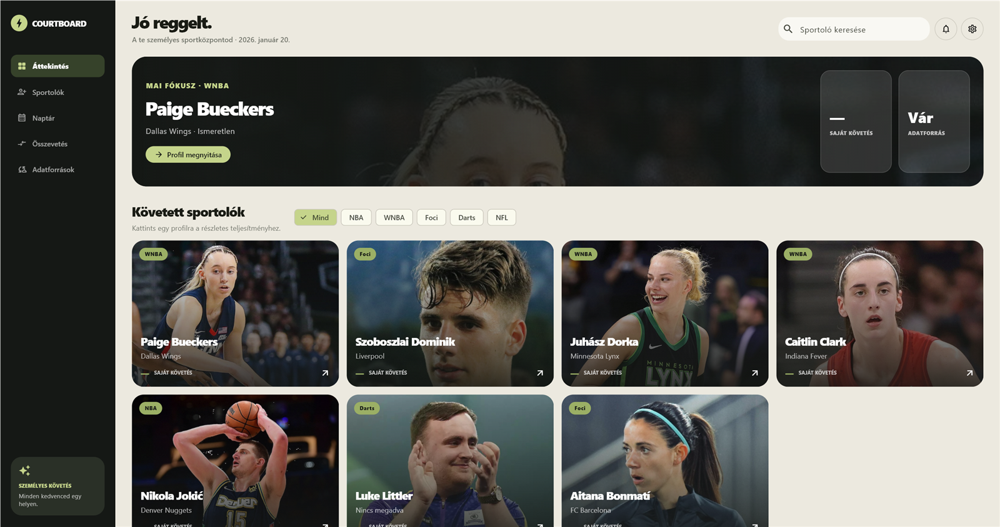
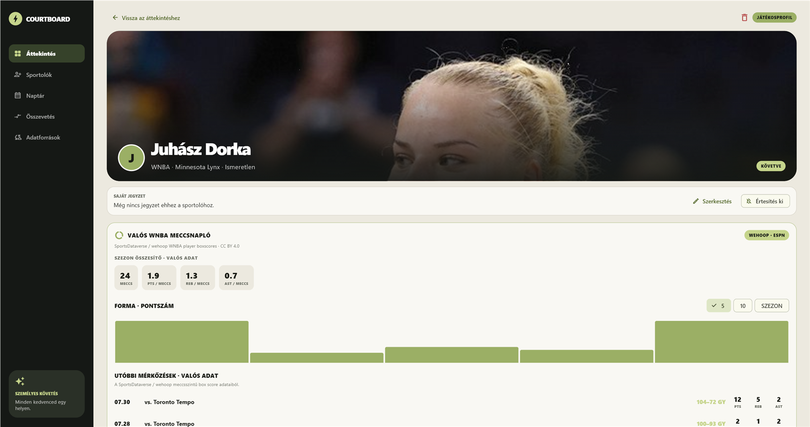

# Courtboard

Windowsos Flutter alkalmazás kedvenc sportolók követésére. Egy sportolói profilt több, egymást kiegészítő adatforrásból épít fel: ha az egyik szolgáltató nem válaszol vagy nem ismeri az adott mezőt, a többi forrás eredménye ettől még megjelenhet.

Az alkalmazás saját **Adatforrás-kézikönyve** kereshető sportág, szolgáltatónév, megjelenő adat, kvóta és cache alapján. Minden kártyán látható:

- mi jelenik meg belőle a Courtboardban;
- mire képes a szolgáltatás, és ebből mit használunk most;
- kell-e kulcs, hol állítható be és mekkora a Free keret;
- mennyi ideig cache-elünk;
- mi történik, ha a forrás hibázik.

## Képernyőképek

### Nyitólap



### Játékosoldal



## Gyors indítás Windows alatt

### Már elkészített kiadás használata

Szükséges:

- Windows 10 vagy 11;
- internet az online sportadatokhoz.

Az API-kulcsok opcionálisak: nélkülük is elindul az app, csak kevesebb forrás lesz elérhető.

1. Töltsd le a GitHub Release `Courtboard-...-Windows.zip` fájlját.
2. Csomagold ki a teljes ZIP-et egy írható mappába. Ne csak a `courtboard.exe` fájlt másold ki: a mellette lévő DLL-ek és a `data` mappa is szükséges.
3. Indítsd el a `courtboard.exe` fájlt. PowerShell scriptet nem kell futtatni.
4. Az appban nyisd meg az **Adatforrások** oldalt, és add meg azokat az opcionális kulcsokat, amelyekre szükséged van.
5. Vegyél fel vagy nyiss meg egy sportolót. Az elérhető szolgáltatók automatikusan együtt dolgoznak.

A Basketball Reference integráció közvetlenül Dartban fut, ezért sem Python, sem `.venv`, sem külön csomagtelepítés nem kell hozzá.

### Fordítás forrásból

További szükséges eszközök:

- Flutter SDK 3.10+;
- Visual Studio a **Desktop development with C++** workload-dal.

```powershell
flutter pub get
flutter analyze
flutter test
flutter build windows --release
.\start-courtboard.ps1
```

A kiadás futtatható fájlja: `build\windows\x64\runner\Release\courtboard.exe`.
GitHubra a `Release` mappa teljes tartalmát kell ZIP-be csomagolni, a mappaszerkezet megőrzésével.

## API-kulcsok

Egyetlen kulcs sem kötelező az app indulásához.

| Szolgáltató | Mire kell | Beállítás az appban | Környezeti változó | Free keret |
|---|---|---|---|---|
| API-Sports | NBA-profil, foci, korlátozott NFL-integráció | API-Sports | `API_SPORTS_KEY` | 100 kérés/nap, 10/perc; korlátozott szezonok |
| BALLDONTLIE | NBA-profil kiegészítés | BALLDONTLIE | `BALLDONTLIE_KEY` | 5 kérés/perc |
| football-data.org | támogatott focicsapatok befejezett meccsei | football-data.org | `FOOTBALL_DATA_KEY` | 12 verseny, 10 kérés/perc |
| RapidAPI Darts API | darts versenylista | RapidAPI · Darts + WNBA | `RAPIDAPI_DARTS_KEY` | 1000 kérés/hó |
| RapidAPI WNBA API | Player Bio és Advanced Statistics | ugyanaz a RapidAPI kulcs | `RAPIDAPI_DARTS_KEY` | 100 kérés/hó |
| YouTube Data API v3 | előkészített, még nem aktív automatikus kereső | nincs külön mező | `YOUTUBE_DATA_KEY` | Google-projektkvóta |

A Darts és a WNBA RapidAPI ugyanazt az alkalmazáskulcsot kapja, de a RapidAPI oldalán **mindkét API Free csomagjára külön fel kell iratkozni**.

Az appban elmentett kulcsok a helyi `%APPDATA%\courtboard_state.json` fájlba kerülnek. Publikált vagy többfelhasználós kiadásnál kliensbe mentett titkok helyett backend proxyt érdemes használni.

## Adatforrás-mátrix

| Adatforrás | Sport | Mi jelenik meg az appban? | Kulcs | Cache / korlát |
|---|---|---|---|---|
| API-Sports | NBA, NFL, foci | NBA profilmezők; befejezett focimeccsek; elérhető friss szezonoknál focista-összesítő; NFL-válasz alapintegráció | saját | Free 100/nap, 10/perc |
| BALLDONTLIE | NBA | közös NBA-profil kiegészítő mezői | saját | Free 5/perc |
| TheSportsDB | több sport, darts | új sportoló képe; NBA-alapadatok; darts profil és utolsó 5 eredmény | publikus `123` | Free legfeljebb 30/perc |
| football-data.org | foci | utolsó 5 befejezett meccs; jelenleg Liverpool névfeloldással | saját | Free 10/perc |
| FotMob | férfi és női foci | aktuális vagy előző szezon: csapat, versenysorozat, értékelés, meccs, gól, gólpassz, sárga és piros lap | nem kell | 6 órás memóriacache; nem hivatalos webes feed |
| SportsDataverse wehoop | WNBA | szezonátlagok (perc, pont, lepattanó, assziszt, labdaszerzés, eladott labda, FG%), forma, box score és utolsó meccsek | nem kell | szezonfájl tartós helyi cache-ben |
| Basketball Reference | NBA, WNBA | NBA aktuális szezonátlagok és alapszakasz + playoff utolsó 5 meccs; WNBA utolsó 5 meccs | nem kell | 6 óra; nem hivatalos webes forrás |
| ESPN `esp.w.1` | női foci | Aitana Bonmatí / Barcelona Femení utolsó 5 befejezett meccse | nem kell | nincs publikált kvóta |
| RapidAPI Darts API | darts | legfeljebb 8 versenycímke | RapidAPI | 6 óra; Free 1000/hó |
| RapidAPI WNBA API | WNBA | Bio, csapat, 9 statisztika és legfeljebb 4 díj | RapidAPI | 7 nap; Free 100/hó |
| YouTube oEmbed | videó | kézzel felvett link címe, bélyegképe és megnyitása | nem kell | helyi playlist |
| YouTube Data API v3 | videó | jelenleg semmi; a keresőadapter elő van készítve | saját | még nincs aktív hívás |

## Hogyan dolgoznak együtt sportáganként?

### NBA

Az API-Sports, a BALLDONTLIE és a TheSportsDB profilhívásai egymástól függetlenül futnak, majd egy közös profilba kerülnek. Egyikük hibája nem dobja el a többiek eredményét. A Basketball Reference közvetlen Dart HTML-feldolgozása adja az aktuális NBA alapszakasz per-game összesítőjét: mérkőzés, perc, pont, összes lepattanó, assziszt, labdaszerzés, eladott labda és FG%. Ugyanez a kliens egészíti ki a profilt az alapszakasz és a rájátszás utolsó öt meccsével.

### WNBA

A wehoop adja a teljes aktuális alapszakasz box score-jait. Ezekből az app valódi meccsenkénti átlagot számol a játszott percre, pontra, összes lepattanóra, asszisztra, labdaszerzésre és eladott labdára; az FG% a teljes bedobott és megkísérelt mezőnydobás arányából készül. A wehoop adja továbbá a formaadatot, a meccseket és az ESPN játékosazonosítót. A névfeloldás ékezet- és névsorrend-független, ezért például a `Juhász Dorka` bevitel a `Dorka Juhasz` ESPN-rekordhoz és a `4398938` azonosítóhoz illeszkedik. A Basketball Reference külön utolsó 5 meccses forrás. Ha a RapidAPI WNBA előfizetés és kulcs is rendelkezésre áll, az app hozzáadja a Player Bio, Advanced Statistics és díjadatokat, köztük az elérhető `TO`/`TOV` mutatót is. A Bio és Advanced hívás egymás után fut, hogy csökkentse a `429 Too Many Requests` hibák esélyét.

### Foci és női foci

Az API-Sports Free kompatibilis, `season` alapú mérkőzéslekérést használ. Nem küld `last` paramétert, mert az a Free csomagban hibát okoz. A focisták **Szezon összesítő** kártyájához az app megpróbálja az API-Sports játékosstatisztikáját is felhasználni. Mivel a Free csomag jelenleg csak régebbi szezonokat enged, a friss adatokat a kulcs nélküli FotMob feed egészíti ki. Csak a naptári év szerinti aktuális vagy előző szezon fogadható el; régebbi adat nem jelenik meg frissként. Azonos csapat és versenysorozat esetén a két forrás mezői összeolvadnak.

A szezonkártyán a csapat, versenysorozat, értékelésátlag, játszott mérkőzések, gólok, gólpasszok, sárga és piros lapok látszanak. A névfeloldás az ékezeteket és a keresztnév–vezetéknév sorrendet is kezeli. A football-data.org jelenleg a Liverpool utolsó befejezett meccseit egészíti ki. Aitana Bonmatí esetén külön ESPN Liga F (`esp.w.1`) adapter szűri a Barcelona Femení meccseit; férfi Barcelona-eredményt nem kever a profilba.

### Darts

A TheSportsDB adja a játékosprofilt és az utolsó 5 eredményt. A Sportbex RapidAPI Darts API a versenykínálatot egészíti ki. Bár az API eseményeket, piacokat és oddsokat is kínál, a Courtboard jelenleg csak a `competitions/3503` végpontot jeleníti meg.

### NFL

Az API-Sports adapter és válaszkezelés be van kötve, de a részletes, játékosonkénti NFL megjelenítés jelenleg még korlátozott. Az Adatforrás-kézikönyv ezt nem jelöli teljes értékű statisztikai feednek.

## Profilképek és videók

Új sportoló felvételekor a TheSportsDB név szerinti keresése próbál profilképet találni. Ha nincs találat, az app monogramot mutat.

A Felfedezés oldalon a felhasználó YouTube URL-t vagy videóazonosítót adhat meg. A cím és bélyegkép a kulcs nélküli YouTube oEmbed válaszból érkezik. A Courtboard nem ír a YouTube-fiókba, és nem hoz létre távoli playlistet. A YouTube Data API keresőadaptere létezik, de jelenleg nincs bekötve automatikus keresési felületre.

## Helyi adatok és cache-ek

| Fájl vagy mappa | Tartalom | Élettartam |
|---|---|---|
| `%APPDATA%\courtboard_state.json` | saját sportolók, jegyzetek, figyelések, API-kulcsok | amíg a felhasználó nem törli |
| `%APPDATA%\courtboard_playlist.json` | mentett YouTube videóazonosítók | amíg a felhasználó nem törli |
| `%APPDATA%\courtboard\wnba_cache` | wehoop WNBA szezon CSV-k | tartós |
| `%APPDATA%\courtboard_cache\basketball_reference` | NBA/WNBA meccsek | 6 óra |
| `%APPDATA%\courtboard_cache\rapidapi_darts` | darts versenylista | 6 óra |
| `%APPDATA%\courtboard_cache\rapidapi_wnba` | WNBA bio és advanced stat | 7 nap; hibánál a régebbi mentés is használható |

## Hibaelhárítás

### `free plans do not have access to the Last parameter`

Friss buildet használj. A focilekérés már nem küldi a Free csomagban tiltott `last` paramétert, hanem támogatott szezonból kér befejezett mérkőzéseket.

### `429 Too Many Requests`

Elérted a szolgáltató percenkénti vagy havi kvótáját. Várj a kvótaablak végéig. A WNBA RapidAPI-hívások szekvenciálisak, a kis keretű szolgáltatások pedig lemezcache-t használnak.

### Nincs NBA/WNBA utolsó mérkőzés

Ellenőrizd az internetkapcsolatot, majd indítsd újra az appot. A Basketball Reference közvetlenül az oldal HTML-tábláit tölti le; Python nem szükséges. Friss hálózati válasz hiányában az app a korábbi lemezcache-t próbálja használni, majd a többi NBA/WNBA-forrásra esik vissza.

### Egy API-kulcs hiányzik

Az app ettől még működik. Az **Adatforrások** oldalon a kártya `KULCS HIÁNYZIK` állapotot mutat, és részletesen leírja, mely adatok maradnak el. A kulcsot ott helyben elmentheted, vagy felhasználói környezeti változóként is beállíthatod, például:

```powershell
[Environment]::SetEnvironmentVariable('API_SPORTS_KEY', 'SAJAT_KULCS', 'User')
```

Környezeti változó módosítása után indítsd újra az alkalmazást.

## Fejlesztői ellenőrzés

```powershell
dart format lib test
flutter analyze
flutter test
flutter build windows --release
```

Az adatforrások központi, kereshető leírása a `lib/data/provider_catalog.dart` fájlban van. Új integráció felvételekor ezt a katalógust és a README mátrixát együtt kell frissíteni.

## Szolgáltatói dokumentáció

- [API-Sports / API-Football árak és Free csomag](https://www.api-football.com/pricing)
- [BALLDONTLIE](https://www.balldontlie.io/)
- [TheSportsDB dokumentáció](https://www.thesportsdb.com/documentation)
- [football-data.org](https://www.football-data.org/client/register)
- [SportsDataverse](https://github.com/sportsdataverse/sportsdataverse-py)
- [Basketball Reference](https://www.basketball-reference.com/)
- [RapidAPI Darts API](https://rapidapi.com/sportbex-api-default-api/api/darts-api)
- [RapidAPI WNBA API](https://rapidapi.com/belchiorarkad-FqvHs2EDOtP/api/wnba-api)
- [YouTube Data API kvótaköltségek](https://developers.google.com/youtube/v3/determine_quota_cost)
