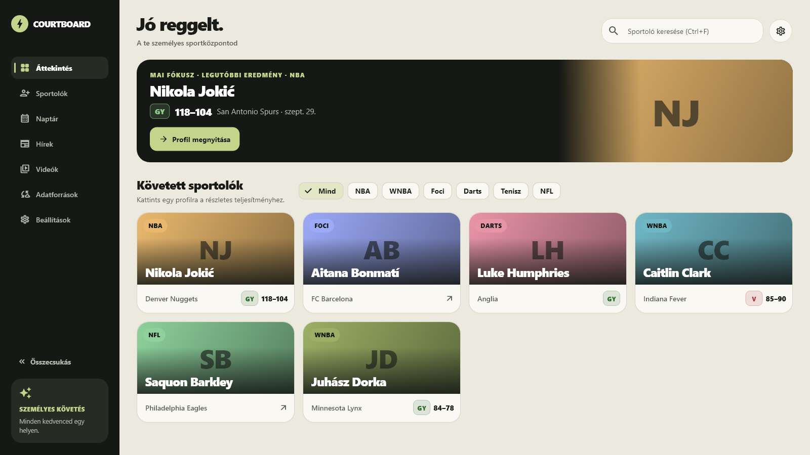
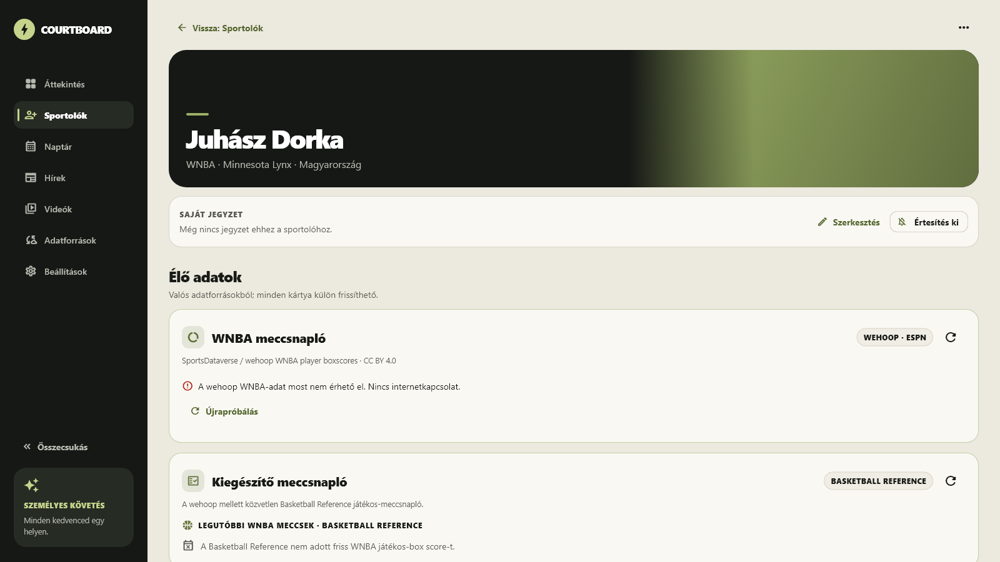
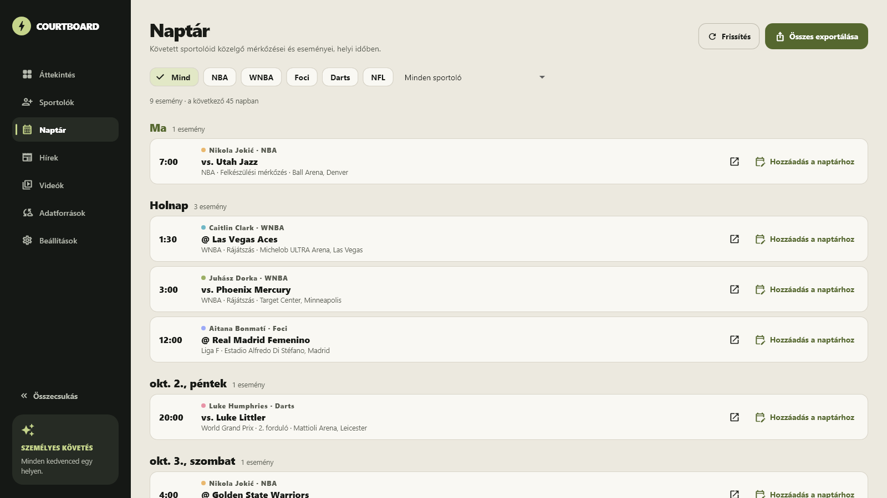
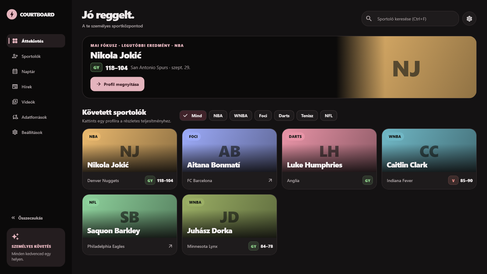

# Courtboard

Windowsos Flutter alkalmazás kedvenc sportolók követésére. Egy sportolói profilt több, egymást kiegészítő adatforrásból épít fel: ha az egyik szolgáltató nem válaszol vagy nem ismeri az adott mezőt, a többi forrás eredménye ettől még megjelenhet.

Az alkalmazás saját **Adatforrás-kézikönyve** kereshető sportág, szolgáltatónév, megjelenő adat, kvóta és cache alapján. Minden kártyán látható:

- mi jelenik meg belőle a Courtboardban;
- mire képes a szolgáltatás, és ebből mit használunk most;
- kell-e kulcs, hol állítható be és mekkora a Free keret;
- mennyi ideig cache-elünk;
- mi történik, ha a forrás hibázik.

## Képernyőképek

### Nyitólap



### Játékosoldal



### Naptár



### Sötét mód



> A képernyőképek tesztkörnyezetben, hálózat nélkül készülnek (`test/screenshots`), ezért a fotók helyén a sportoló színéből képzett helyőrző látszik, az élő kártyák a hálózat nélküli állapotot mutatják, a nyitólap eredményei és a naptár eseményei pedig mintaadatok.

## Felület és személyes beállítások

- Az **Áttekintés** fogaskerék ikonja és a bal oldali **Beállítások** menüpont ugyanazt a beállítási oldalt nyitja meg.
- A megjelenéshez választható a zöld és a bordó kiemelőszín, valamint a **Világos**, **Sötét** vagy **Rendszer** (a Windows beállítását követő) mód.
- **Reszponzív elrendezés:** 1200 px felett teljes, feliratos oldalsáv (a felirat nélküli, ikonos változatra összecsukható, és az app megjegyzi a választást); 800–1200 px között ikonos sáv eszköztippekkel; ennél keskenyebb ablakban hamburger menü nyitja a navigációt. Ultraszéles ablakban a tartalom legfeljebb 1440 px széles, középre zárva. Az ablak legkisebb mérete kb. 800×600.
- **Billentyűparancsok:** `Ctrl+F` keresés, `Esc` vagy `Alt+←` vissza a profilból (és párbeszédablak bezárása), `Ctrl+R` / `F5` frissítés (profil adatkártyái, naptár, hírek), `Ctrl+1…7` menüpontok, `Ctrl+N` új sportoló. A teljes lista a **Beállítások → Billentyűparancsok** alatt látható; billentyűzettel bejárva minden kártya, menüpont, chip és gomb jól látható fókuszkeretet kap.
- A nyitólap **Mai fókusz** blokkja a profilokon és a naptárban már betöltött adatokból mutatja a legközelebbi eseményt vagy a legfrissebb eredményt; ha még nincs ilyen, a követett sportolók sportáganként összesítve és gyors műveletek jelennek meg. A kártyák a legutóbbi eredményt is jelzik (például „GY 118–104”), kitalált adat nélkül.
- Az app a rendszer szövegméretét is követi; a fő oldalak 1,3-es nagyításnál sem vágnak le tartalmat.
- Az Áttekintés kártyái és a Sportolók listája egymástól függetlenül rendezhető saját sorrend, név, sportág vagy csapat szerint.
- A **Sportolók** oldalon név szerinti keresés és sportág szerinti szűrés használható.
- A **Naptár** a követett sportolók közelgő mérkőzéseit és eseményeit mutatja napok szerint csoportosítva, sportág- és sportolószűrővel; egy-egy esemény vagy a teljes lista `.ics` fájlként a naptáralkalmazásba vihető (lásd [Naptár és .ics export](#naptár-és-ics-export)).
- Az app induláskor (legfeljebb 12 óránként) megnézi, van-e újabb kiadás a GitHubon; ha igen, egy diszkrét sáv jelzi (lásd [Frissítés-ellenőrzés](#frissítés-ellenőrzés)).
- Az ablak mérete, helye és teljes méretű állapota megmarad; a Courtboard a tálcán is futhat, Windows-értesítést küld meccskezdésről, új eredményről és új hírről, és indulhat a Windows-zal (lásd [Tálca, értesítések és automatikus indítás](#tálca-értesítések-és-automatikus-indítás)).
- A **Videók** médiatár az összes sportolóhoz mentett YouTube-videót egy helyen mutatja; cím, sportoló és sportág szerint szűrhető.
- A **Hírek** oldal RSS-forrásokból és a FOX aktuális NBA-, WNBA-, foci- és tenisz-oldalfeedjeiből épít tartós, cím, sportág, sportoló és forrás szerint kereshető helyi archívumot.
- A választott téma és rendezések automatikusan a helyi állapotfájlba kerülnek.
- A darts sportolóknál nincs csapatmező, ezért az üres vagy „Nincs megadva” csapat nem jelenik meg a kártyákon és profilokon.
- A teniszprofiloknál ugyancsak nincs csapatmező. A Live Tennis API adja az aktuális ranglistát, a játékos alapadatait, az élő állást és a következő mérkőzéseket.

## Gyors indítás Windows alatt

### Már elkészített kiadás használata

Szükséges:

- Windows 10 vagy 11;
- internet az online sportadatokhoz.

Az API-kulcsok opcionálisak: nélkülük is elindul az app, csak kevesebb forrás lesz elérhető.

1. Töltsd le a GitHub Release `Courtboard-...-Windows.zip` fájlját.
2. Csomagold ki a teljes ZIP-et egy írható mappába. Ne csak a `courtboard.exe` fájlt másold ki: a mellette lévő DLL-ek és a `data` mappa is szükséges.
3. Indítsd el a `courtboard.exe` fájlt. PowerShell scriptet nem kell futtatni.
4. Az appban nyisd meg az **Adatforrások** oldalt, és add meg azokat az opcionális kulcsokat, amelyekre szükséged van.
5. Vegyél fel vagy nyiss meg egy sportolót. Az elérhető szolgáltatók automatikusan együtt dolgoznak.

A Basketball Reference integráció közvetlenül Dartban fut, ezért sem Python, sem `.venv`, sem külön csomagtelepítés nem kell hozzá.

### Fordítás forrásból

További szükséges eszközök:

- Flutter SDK 3.44+ (Dart 3.12+);
- Visual Studio a **Desktop development with C++** workload-dal.

```powershell
flutter pub get
flutter analyze
flutter test
flutter build windows --release
.\start-courtboard.ps1
```

A kiadás futtatható fájlja: `build\windows\x64\runner\Release\courtboard.exe`.
GitHubra a `Release` mappa teljes tartalmát kell ZIP-be csomagolni, a mappaszerkezet megőrzésével.

### MSIX csomag

A ZIP mellett telepíthető MSIX csomag is készíthető. A beállítások a `pubspec.yaml` `msix_config` szakaszában vannak (név: Courtboard, kiadó: Mp3Pintyo, azonosító: `Mp3Pintyo.Courtboard`, képesség: `internetClient`, nyelvek: `hu-hu`, `en-us`, Store nélkül). Az MSIX-verzió a pubspec verziójából jön (`0.11.0+12` → `0.11.0.0`); ezt egy teszt is ellenőrzi.

```powershell
# Release build + MSIX; a kész csomag: dist\Courtboard-<verzió>-Windows-x64.msix
powershell -ExecutionPolicy Bypass -File tool\build_msix.ps1

# Ha a release build már elkészült:
powershell -ExecutionPolicy Bypass -File tool\build_msix.ps1 -SkipBuild

# Saját aláíró tanúsítvánnyal (.pfx):
powershell -ExecutionPolicy Bypass -File tool\build_msix.ps1 -CertificatePath C:\cert\courtboard.pfx -CertificatePassword ****
```

A script a `flutter build windows --release`, majd a `dart run msix:create --build-windows false` parancsot futtatja. **Semmit nem telepít**: sem tanúsítványt, sem alkalmazást.

**Aláírás és telepítés.** Saját tanúsítvány nélkül a `msix` csomag beépített **teszttanúsítványával** (`CN=Msix Testing, O=Msix Testing Corporation…`) aláírt csomag készül. Ezt a Windows alapból nem tekinti megbízhatónak, ezért a dupla kattintásos telepítés hibát jelez. Két lehetőség:

1. **A teszttanúsítvány megbízhatóvá tétele (csak saját, fejlesztői gépen):** a `.msix` fájl *Tulajdonságok → Digitális aláírások → Részletek → Tanúsítvány megtekintése → Tanúsítvány telepítése* lépéseivel a tanúsítványt a **Helyi számítógép → Megbízható személyek** tárolóba kell tenni (rendszergazdai jog kell). Utána a `.msix` dupla kattintással telepíthető. A teszttanúsítvány mindenkinél ugyanaz, ezért éles terjesztésre nem való; használat után a tárolóból törölhető.
2. **Saját tanúsítvány:** a `-CertificatePath` / `-CertificatePassword` paraméterrel saját (például vállalati vagy kereskedelmi kódaláíró) `.pfx` tanúsítvánnyal írd alá; a kiadó (publisher) a tanúsítvány alanyából kerül a csomagba.

A **Fejlesztői mód** (Beállítások → Rendszer → Fejlesztőknek) önmagában nem teszi megbízhatóvá az aláírót; az aláírt csomag telepítéséhez ilyenkor is az 1. vagy a 2. pont kell. Telepítés után a Courtboard a Start menüből indítható, és a *Beállítások → Alkalmazások* alatt távolítható el; a felhasználói adatok (`%APPDATA%`) a ZIP-es változattal közösek.

## API-kulcsok

Egyetlen kulcs sem kötelező az app indulásához.

| Szolgáltató | Mire kell | Beállítás az appban | Környezeti változó | Free keret |
|---|---|---|---|---|
| API-Sports | NBA-profil, foci, korlátozott NFL-integráció | API-Sports | `API_SPORTS_KEY` | 100 kérés/nap, 10/perc; korlátozott szezonok |
| BALLDONTLIE | NBA-profil kiegészítés | BALLDONTLIE | `BALLDONTLIE_KEY` | 5 kérés/perc |
| football-data.org | Free ligák focistáinak alapadatai és támogatott klubok mérkőzései | football-data.org | `FOOTBALL_DATA_KEY` | 12 verseny, 10 kérés/perc |
| RapidAPI Darts API | darts versenylista | RapidAPI (Darts + WNBA) | `RAPIDAPI_KEY` (régi név: `RAPIDAPI_DARTS_KEY`) | 1000 kérés/hó |
| RapidAPI WNBA API | Player Bio és Advanced Statistics | ugyanaz a RapidAPI kulcs | `RAPIDAPI_KEY` (régi név: `RAPIDAPI_DARTS_KEY`) | 100 kérés/hó |
| Live Tennis API | teniszprofil, ranglista, élő és közelgő mérkőzések | Live Tennis API | `LIVE_TENNIS_API_KEY` | 30 kérés/perc, 1000/nap |
| YouTube Data API v3 | előkészített, még nem aktív automatikus kereső | nincs külön mező | `YOUTUBE_DATA_KEY` | Google-projektkvóta |

A Darts és a WNBA RapidAPI ugyanazt az alkalmazáskulcsot kapja, de a RapidAPI oldalán **mindkét API Free csomagjára külön fel kell iratkozni**.

Az appban elmentett kulcsok a Windows Hitelesítőadat-kezelőbe (Credential Manager) kerülnek, `Courtboard/courtboard.api_key.…` néven: a Windows ezeket a felhasználói fiókhoz kötve, titkosítva (DPAPI) tárolja, így nem szerepelnek a `%APPDATA%\courtboard_state.json` állapotfájlban. A mentett kulcsok a **Vezérlőpult → Hitelesítőadat-kezelő → Windows hitelesítő adatok** alatt meg is tekinthetők és törölhetők. Ha az appban mentett kulcs hiányzik, a fenti környezeti változó érvényes.

A 0.9.0 előtti verziók a kulcsokat titkosítatlanul az állapotfájlba írták. Az első indításkor az app ezeket átköltözteti a biztonságos tárolóba, visszaolvasással ellenőrzi, és csak ezután törli őket a JSON-ból. Ha a biztonságos tároló nem érhető el, a kulcsok a régi helyükön maradnak, az app memóriából használja őket, az **Adatforrások** oldal pedig figyelmeztetést mutat.

Publikált vagy többfelhasználós kiadásnál kliensbe mentett titkok helyett backend proxyt érdemes használni.

## Adatforrás-mátrix

| Adatforrás | Sport | Mi jelenik meg az appban? | Kulcs | Cache / korlát |
|---|---|---|---|---|
| API-Sports | NBA, NFL, foci | NBA profilmezők; befejezett focimeccsek; elérhető friss szezonoknál focista-összesítő; NFL-válasz alapintegráció | saját | Free 100/nap, 10/perc |
| BALLDONTLIE | NBA | közös NBA-profil kiegészítő mezői | saját | Free 5/perc |
| TheSportsDB | több sport, foci, darts | új sportoló képe; NBA-alapadatok; nem támogatott fociligáknál klubmeccsek; darts profil és utolsó 5 eredmény | publikus `123` | Free legfeljebb 30/perc |
| football-data.org | foci | dinamikusan feloldott játékos klubja, posztja, nemzetisége, születési dátuma, mezszáma és azonosítója; támogatott klubok utolsó 5 meccse | saját | Free 10/perc; csapatkeretek 7 napos lemezcache-ben |
| FotMob | férfi és női foci | aktuális vagy előző szezon: csapat, versenysorozat, értékelés, meccs, gól, gólpassz, sárga és piros lap | nem kell | 6 órás memóriacache; nem hivatalos webes feed |
| SportsDataverse wehoop | WNBA | szezonátlagok (perc, pont, lepattanó, assziszt, labdaszerzés, eladott labda, FG%), forma, box score és utolsó meccsek | nem kell | szezonfájl tartós helyi cache-ben |
| Basketball Reference | NBA, WNBA | NBA aktuális szezonátlagok és alapszakasz + playoff utolsó 5 meccs; WNBA utolsó 5 meccs | nem kell | 6 óra; nem hivatalos webes forrás |
| ESPN `esp.w.1` | női foci | Aitana Bonmatí / Barcelona Femení utolsó 5 befejezett meccse és (a Naptárban) következő meccsei | nem kell | nincs publikált kvóta |
| ESPN csapatmenetrend | NBA, WNBA, NFL | Naptár: a csapat következő meccsei, ellenfél, hazai/idegen, liga és szakasz, helyszín, Gamecast-link | nem kell | sportolónként 6 óra, csapatlista 7 nap; legfeljebb 30 kérés/perc |
| GitHub Releases | alkalmazás | frissítés-ellenőrzés: a legfrissebb kiadás verziója és oldala | nem kell | 12 óra; hitelesítés nélkül 60 kérés/óra |
| RapidAPI Darts API | darts | legfeljebb 8 versenycímke | RapidAPI | 6 óra; Free 1000/hó |
| RapidAPI WNBA API | WNBA | Bio, csapat, 9 statisztika és legfeljebb 4 díj | RapidAPI | 7 nap; Free 100/hó |
| Live Tennis API | tenisz | ranglista és profiladatok; élő szett-, játék- és pontállás; legfeljebb 5 következő meccs | saját | 10 perc; Free 30/perc és 1000/nap |
| FOX Sports JSON-oldalfeed | NBA, WNBA, foci, tenisz | cím, rövid összefoglaló, kép, valódi publikálási dátum és eredeti cikk | nem kell | sportáganként a legfrissebb 100 cikk/frissítés; 20 perc; tartós helyi archívum |
| CBS Sports RSS | NBA, foci, tenisz | cím, rövid összefoglaló, kép, dátum és eredeti cikk | nem kell | 20 perc; tartós helyi archívum |
| ESPN RSS | NBA, WNBA, foci, tenisz | opcionálisan cím, forrás, dátum és kötelező eredeti link | nem kell | 20 perc; külön bekapcsolandó |
| Guardian RSS | foci, tenisz | opcionálisan cím, rövid összefoglaló, kép, dátum és eredeti cikk | nem kell | 20 perc; személyes, nem kereskedelmi használat |
| YouTube oEmbed | videó | kézzel felvett link címe, bélyegképe és megnyitása | nem kell | helyi playlist |
| YouTube Data API v3 | videó | jelenleg semmi; a keresőadapter elő van készítve | saját | még nincs aktív hívás |

## Naptár és .ics export

A **Naptár** a követett sportolók közelgő eseményeit a már bekötött forrásokból gyűjti össze, sportolónként külön, fokozatosan: ami megjött, azonnal látszik, egy forrás hibája pedig csak egy apró megjegyzés az oldal alján (**Forrásmegjegyzések**).

| Sportág | Forrás | Megjegyzés |
|---|---|---|
| NBA, WNBA, NFL | ESPN csapatmenetrend (`site.api.espn.com/…/teams/{csapat}/schedule`) | kulcs nélkül; a csapatot teljes név, rövidítés vagy becenév alapján oldja fel |
| Foci | football-data.org (kulccsal), különben TheSportsDB következő meccsei | Aitana Bonmatí / „Femení” csapatnál az ESPN Liga F (`esp.w.1`) |
| Tenisz | Live Tennis API közelgő meccsei és fixture-jei | kulcs kell; kulcs nélkül megjegyzés jelzi |
| Darts | TheSportsDB (a játékos nevét tartalmazó események), RapidAPI Darts (kulccsal, ha a versenylista dátumot is ad) | az ingyenes források ritkán adnak játékosszintű menetrendet |

- Az események **helyi időben**, napok szerint csoportosítva jelennek meg („Ma”, „Holnap”, majd például „okt. 3., szombat”), a következő 45 napra, sportolónként legfeljebb 20 tétellel. A lista sportág és sportoló szerint szűrhető.
- Egy sorban: kezdési idő (bizonytalan időpontnál „később”), sportoló, ellenfél (`vs.` hazai, `@` idegenbeli meccs), bajnokság/szakasz és helyszín, valamint a mérkőzés ESPN/TheSportsDB-oldalának linkje.
- Az eredmény sportolónként 6 órás lemezcache-be kerül (`%APPDATA%\Courtboard\cache\upcoming_events`); a **Frissítés** gomb (`Ctrl+R`) ezt kikerüli. Hálózati hibánál a korábbi lista marad, „régebbi mentett adat” jelzéssel. A kvótás szolgáltatók (Live Tennis API, RapidAPI) a közös kéréskorlátozón és keretszámlálón keresztül kapnak kérést.
- A betöltés induláskor a háttérben is lefut, így a nyitólap **Mai fókusz** blokkja a naptár megnyitása nélkül is a legközelebbi eseményt mutatja.

**.ics export.** Minden eseménynél a **Hozzáadás a naptárhoz** gomb egy egyeseményes `.ics` fájlt ír az ideiglenes mappába (`%TEMP%\courtboard`), és megnyitja az alapértelmezett naptáralkalmazással (Outlook, Windows Naptár…). Az **Összes exportálása** a listában éppen látható eseményeket egyetlen fájlba menti: a mentési ablakban választható a hely (alapnév: `courtboard-naptar.ics`); ha a mentési ablak nem érhető el, a fájl a `%USERPROFILE%\Downloads\courtboard-naptar.ics` helyre kerül. A megjelenő üzenet **Megnyitás** gombja megnyitja a fájlt.

A fájl kézzel írt, RFC 5545 szerinti iCalendar: `PRODID:-//Courtboard//HU`, UTC időpontok, sportág szerinti alapértelmezett hossz (kosárlabda, foci és tenisz 2 óra, NFL 3,5 óra, darts 3 óra), bizonytalan időpontnál egész napos esemény, escape-elt szöveg és 75 bájtos sortördelés. Az esemény azonosítója (`UID`) a forrásból, sportolóból, kezdésből és ellenfélből képzett stabil hash, így ugyanazt az eseményt újra importálva a naptárprogram frissíti, nem duplikálja.

## Frissítés-ellenőrzés

Induláskor az app a GitHub Releases API-tól (`/repos/mp3pintyo/Courtboard/releases/latest`) lekéri a legfrissebb kiadást, és összeveti a futó verzióval (a Windows-exe verzióadataiból, amelyek fordításkor a `pubspec.yaml`-ből kerülnek bele). Ha újabb, végleges kiadás van, a tartalom tetején diszkrét sáv jelenik meg: „Új verzió érhető el: 0.12.0 – **Letöltés**”; a Letöltés a kiadás GitHub-oldalát nyitja meg. Az app semmit nem tölt le és nem telepít magától.

- A választ 12 órára gyorsítótárazza, így legfeljebb ennyi időnként kérdez; a GitHub hitelesítés nélküli (óránként 60 kéréses) korlátjánál barátságos üzenet jelenik meg.
- Előzetes (prerelease) és vázlat kiadásról nem szól.
- **Beállítások → Frissítések:** a jelenlegi verzió, az **Automatikus frissítés-ellenőrzés** kapcsoló (alapból bekapcsolva, a helyi állapotfájlba mentve) és a **Keresés most** gomb, amely azonnal, cache nélkül ellenőriz és kiírja az eredményt.

## Tálca, értesítések és automatikus indítás

**Ablak.** A Courtboard megjegyzi az ablak méretét, helyét és teljes méretű állapotát, és a következő indításkor ugyanott nyílik meg. A helyzetet fizikai képpontban, a Windows saját `WINDOWPLACEMENT` adatával menti, így több, eltérő nagyítású monitornál is pontos. Ha a mentett hely már nem látható (például leválasztották a második monitort), az ablak az alapméretben (1440×900) középre kerül; a kilógó vagy a monitornál nagyobb ablak a munkaterületre igazodik. Az ablak az első képkocka után, már a mentett helyen jelenik meg (nincs ugrás), a legkisebb mérete kb. 800×600.

**Tálca.** A tálcaikon (eszköztipp: „Courtboard”) bal kattintásra előhozza az ablakot, jobb kattintásra menüt nyit:

- **Megnyitás**
- **Frissítés most** – azonnali háttérellenőrzés (lásd lent)
- **Értesítések szüneteltetése 1 órára** / **Értesítések folytatása**
- **Kilépés**

**Beállítások → Tálca és indítás:**

- **Bezáráskor a tálcára kicsinyítés** (alapból kikapcsolva): az ablak bezárása után az app a tálcán fut tovább, és értesítést is küld. Az első ilyen bezáráskor egyszeri tipp jelzi, hogyan lehet kilépni (tálcaikon → **Kilépés**).
- **Indítás a Windows-zal:** bejelentkezéskor automatikusan elindul (a `HKCU\Software\Microsoft\Windows\CurrentVersion\Run` alatti `Courtboard` érték; rendszergazdai jog nem kell, csak az aktuális felhasználót érinti).
- **Tálcára minimalizálva indul:** Windows-indításkor ablak nélkül, csak a tálcaikonnal indul (`courtboard.exe --minimized`).

**Értesítések.** Az app a háttérben – a tálcán is – figyeli azokat a sportolókat, akiknél a profilon bekapcsoltad az **Értesítés** gombot, és Windows-értesítést küld; kattintásra előjön az ablak, és megnyílik a sportoló profilja (több sportolót érintő hírösszesítőnél a Hírek oldal).

- **Meccskezdés:** 15 perccel a kezdés előtt, eseményenként egyszer (a már jelzett események újraindítás után sem ismétlődnek). A következő ellenőrzés előtt esedékes kezdésekhez pontos emlékeztető időzítődik.
- **Új eredmény:** NBA-, WNBA- és NFL-sportolóknál az ESPN csapatmenetrendjéből (óránként legfeljebb egy kérés csapatonként); az új eredmény a nyitólap kártyáján is megjelenik. Más sportágnál ez még nem automatikus.
- **Új hír:** a hírfrissítés (forrásonként legfeljebb 20 percenként) után a sportolóhoz kapcsolódó új cikkek; több hír egy összesítő értesítésbe kerül.
- Az **első ellenőrzés** csak megjegyzi a meglévő eredményeket és híreket, így bekapcsoláskor nincs értesítésözön.

**Beállítások → Értesítések:** fő kapcsoló, típusonkénti kapcsolók (meccskezdés, eredmény, hír), ellenőrzési gyakoriság (5 / 15 / 30 / 60 perc, alapból 15), **Csendes órák** (például 23:00–07:00; ilyenkor és szüneteltetés alatt nem jelenik meg értesítés, és utólag sem pótlódik) és **Teszt értesítés** gomb. A háttérellenőrzés a források gyorsítótárát és kvótáját tartja: a menetrend legfeljebb 6 óránként, az eredmények óránként, a hírek 20 percenként frissülnek, akármilyen sűrű is az ellenőrzés.

**Technikai megjegyzések.**

- Ablak: `window_manager` (bezárás elfogása, megjelenítés, események) és közvetlen Win32-hívás (`GetWindowPlacement` / `SetWindowPlacement`). A futtató (`windows/runner`) az első képkockánál már nem jeleníti meg magától az ablakot; ha a Dart oldal 4 mp-en belül nem teszi meg, a futtató tartalékként megjeleníti (kivéve `--minimized` indításnál).
- Tálca: `tray_manager` (a tálcaikon az `assets/tray/app_icon.ico`, a futtató ikonjának másolata).
- Értesítés: `local_notifier` (WinToast). Az első értesítéskor a Windows a Start menüben „Courtboard” parancsikont hoz létre az alkalmazásazonosítóval – a nem csomagolt asztali appok értesítéseihez ez kell. Ha a toast nem érhető el, tartalékként a tálcaikon buborékértesítése jelenik meg (ilyenkor a kattintás csak az ablakot hozza elő).
- A `flutter_local_notifications` Windows-változata ATL-t igényel (a Visual Studio „C++ ATL” összetevője), ezért nem került be; a `launch_at_startup` csomag újabb változatai a `win32` 5-öt kérik (az app a 6-ost használja), ezért a Windows-zal indítás közvetlen `advapi32`-hívással készült.
- **MSIX-csomagnál** a rendszerleíró adatbázis virtualizált, ezért ott az **Indítás a Windows-zal** kapcsoló nem használható; a csomagolt appot a Windows *Beállítások → Alkalmazások → Indítás* oldalán lehet automatikus indításra állítani.

## Hogyan dolgoznak együtt sportáganként?

### NBA

Az API-Sports, a BALLDONTLIE és a TheSportsDB profilhívásai egymástól függetlenül futnak, majd egy közös profilba kerülnek. Egyikük hibája nem dobja el a többiek eredményét. A Basketball Reference közvetlen Dart HTML-feldolgozása adja az aktuális NBA alapszakasz per-game összesítőjét: mérkőzés, perc, pont, összes lepattanó, assziszt, labdaszerzés, eladott labda és FG%. Ugyanez a kliens egészíti ki a profilt az alapszakasz és a rájátszás utolsó öt meccsével.

### WNBA

A wehoop adja a teljes aktuális alapszakasz box score-jait. Ezekből az app valódi meccsenkénti átlagot számol a játszott percre, pontra, összes lepattanóra, asszisztra, labdaszerzésre és eladott labdára; az FG% a teljes bedobott és megkísérelt mezőnydobás arányából készül. A wehoop adja továbbá a formaadatot, a meccseket és az ESPN játékosazonosítót. A névfeloldás ékezet- és névsorrend-független, ezért például a `Juhász Dorka` bevitel a `Dorka Juhasz` ESPN-rekordhoz és a `4398938` azonosítóhoz illeszkedik. A Basketball Reference külön utolsó 5 meccses forrás. Ha a RapidAPI WNBA előfizetés és kulcs is rendelkezésre áll, az app hozzáadja a Player Bio, Advanced Statistics és díjadatokat, köztük az elérhető `TO`/`TOV` mutatót is. A Bio és Advanced hívás egymás után fut, hogy csökkentse a `429 Too Many Requests` hibák esélyét.

### Foci és női foci

Az API-Sports Free kompatibilis, `season` alapú mérkőzéslekérést használ. Nem küld `last` paramétert, mert az a Free csomagban hibát okoz. A focisták **Szezon összesítő** kártyájához az app megpróbálja az API-Sports játékosstatisztikáját is felhasználni. Mivel a Free csomag jelenleg csak régebbi szezonokat enged, a friss adatokat a kulcs nélküli FotMob feed egészíti ki. Csak a naptári év szerinti aktuális vagy előző szezon fogadható el; régebbi adat nem jelenik meg frissként. Azonos csapat és versenysorozat esetén a két forrás mezői összeolvadnak.

A szezonkártyán a csapat, versenysorozat, értékelésátlag, játszott mérkőzések, gólok, gólpasszok, sárga és piros lapok látszanak. A névfeloldás az ékezeteket és a keresztnév–vezetéknév sorrendet is kezeli. A football-data.org adapter már nem beégetett csapatazonosítókból dolgozik: a Free csapatlistában dinamikusan oldja fel a klubot, majd az aktuális keretben név alapján keresi meg a játékost. A profilkártyán klub, poszt, nemzetiség, születési dátum, mezszám és football-data.org játékosazonosító jelenhet meg. A 12 Free `TIER_ONE` verseny keretei 7 napos lemezcache-be kerülnek, a lekérések pedig a 10 kérés/perces korláthoz igazodnak.

A football-data.org Free csomag nem ad játékosonkénti meccsaggregációt, ezért a gól-, gólpassz-, lap- és értékelésadatokat továbbra is a FotMob vagy az API-Sports egészíti ki. Ha egy klub ligája nem része a football-data.org Free kínálatának – ilyen az MLS és az Inter Miami –, a csapat utolsó és következő mérkőzéseit a kulcs nélküli TheSportsDB fallback tölti be. Aitana Bonmatí esetén külön ESPN Liga F (`esp.w.1`) adapter szűri a Barcelona Femení meccseit; férfi Barcelona-eredményt nem kever a profilba.

### Darts

A TheSportsDB adja a játékosprofilt és az utolsó 5 eredményt. A Sportbex RapidAPI Darts API a versenykínálatot egészíti ki. Bár az API eseményeket, piacokat és oddsokat is kínál, a Courtboard jelenleg csak a `competitions/3503` végpontot jeleníti meg.

### NFL

Az API-Sports adapter és válaszkezelés be van kötve, de a részletes, játékosonkénti NFL megjelenítés jelenleg még korlátozott. Az Adatforrás-kézikönyv ezt nem jelöli teljes értékű statisztikai feednek.

### Tenisz

Új sportoló felvételekor válaszd a **Tenisz** sportágat; csapatot nem kell megadni. A Live Tennis API kulcsa az **Adatforrások** oldalon menthető. A név szerinti játékoskeresés ékezet- és névsorrend-független, majd a részletes profilból az app megjeleníti az aktuális ranglistát, ranglistapontot, sorozatot, országot, ütőkezet, fonákot és születési dátumot.

Az élő mérkőzésnél az ellenfél, a verseny, a szett-, játék- és pontállás látható. A közelgő meccseket az azonosítóval rendelkező upcoming feed és a név alapú fixture lista együtt tölti ki. A játékos saját sorozatkódját csak akkor küldjük szűrőként, ha egyértelműen `atp` vagy `wta`, mert az alsóbb sorozatok profilkódjai eltérnek az API szűrőértékeitől.

A Free csomaghoz tartozó `completed`, `/history`, piac-, modell- és WebSocket-végpontokat az app nem hívja. Egy profil friss betöltése legfeljebb öt kvótás kérést használ, a `/usage` ellenőrzés kvótamentes; a 10 perces lemezcache védi a napi 1000 kéréses keretet. A kézi frissítés tudatosan megkerüli a cache-t.

### Hírek és tartós hírarchívum

A **Hírek** oldal alapból a FOX Sports és a CBS Sports NBA-, WNBA-, foci- és teniszforrásait dolgozza fel. A FOX optimalizált RSS-feedjei egyenetlenek voltak: a WNBA legújabb eleme hónapokkal korábbi, a teniszfeed pedig több éves cikkeket is tartalmazott. Ezért mind a négy FOX sportág a FOX weboldalak által is használt aktuális JSON-hírfolyamból érkezik. Sportáganként kérésenként a legfrissebb 100 cikket kapjuk; a helyi archívum az újabb frissítésekkel tovább növekszik. A forráskezelőben az ESPN és a Guardian feedjei külön kapcsolhatók be.

A helyi adatbázis mindig azonnal betöltődik, a hálózati frissítés csak utána fut, ezért egy hibás vagy átmenetileg nem elérhető forrás nem tünteti el a korábbi híreket. A kártyán mindig a cikk publikálási dátuma jelenik meg, nem a letöltés ideje. Az adatbázis-migráció eltávolítja az első kiadás FOX-elemeit, amelyeknél a hibás időzóna-feldolgozás miatt a lekérési idő került publikálási dátumként tárolásra; a következő frissítés helyes dátummal tölti vissza őket.

- Az automatikus frissítési ablak 20 perc; a Frissítés gomb tudatosan megkerüli ezt az időkorlátot.
- A letöltött hírek SQLite-adatbázisba kerülnek, és az app nem törli őket automatikusan. Így hónapokkal később és hálózat nélkül is kereshetők maradnak.
- A deduplikáció elsősorban kanonizált URL, ennek hiányában GUID alapján történik. Egy hír több sportághoz és több feedhez is kapcsolódhat anélkül, hogy duplán jelenne meg.
- A feldolgozó kezeli az RSS, Atom és FOX JSON eltéréseit, az RFC 822 numerikus időzóna-eltolásokat, valamint az ESPN `EST`/`EDT` jelöléseit. A leírás HTML-entitásait dekódolja, eltávolítja a `script`, `style`, `noscript` elemeket és a tageket, normalizálja a whitespace-t, majd legfeljebb 350 karaktert tárol.
- A keresés a címben és az összefoglalóban fut. A sportoló szerinti illesztés ékezet- és névsorrend-független tokenekkel működik.
- A tárolt kép az RSS-ben kapott külső kép-URL; maga a képfájl nincs archiválva. A cím, összefoglaló, dátum, forrás és eredeti link viszont tartósan megmarad.
- A hírmodell egy `NewsProvider` interfészen keresztül kap adatot, ezért később RSS mellett hírszolgáltatói API vagy más importforrás is hozzáadható az adatbázis és a felület átírása nélkül.

Az ESPN-tartalomnál a Courtboard csak a feed által átadott címet és metaadatokat használja, jól láthatóan feltünteti a forrást, és mindig az eredeti ESPN-cikkre linkel. Az ESPN-feed köré nem szabad reklámot helyezni. A Guardian feedjei személyes, nem kereskedelmi használatra kapcsolhatók be. A FOX és más szolgáltatók feltételei változhatnak; nyilvános vagy üzleti terjesztés előtt a mindenkori felhasználási feltételeket újra ellenőrizni kell.

## Profilképek és videók

Új sportoló felvételekor a TheSportsDB név szerinti keresése próbál profilképet találni. Ha nincs találat, az app a sportoló színéből képzett, monogramos helyőrzőt mutat.

A képek (profilfotók, videó-bélyegképek, hírképek) a megjelenített mérethez igazítva dekódolódnak, és lemezre mentve 30 napig offline is elérhetők (`%APPDATA%\Courtboard\cache\images`); letöltési hibánál a korábban mentett példány marad látható.

A sportolói profilon a felhasználó YouTube URL-t vagy videóazonosítót adhat meg. A cím és bélyegkép a kulcs nélküli YouTube oEmbed válaszból érkezik. A mentések a központi **Videók** oldalon is megjelennek, ahol cím, sportoló és sportág szerint kereshetők, lejátszhatók vagy eltávolíthatók. A Courtboard nem ír a YouTube-fiókba, és nem hoz létre távoli playlistet. A YouTube Data API keresőadaptere létezik, de jelenleg nincs bekötve automatikus keresési felületre.

## Helyi adatok és cache-ek

| Fájl vagy mappa | Tartalom | Élettartam |
|---|---|---|
| `%APPDATA%\courtboard_state.json` | saját sportolók, jegyzetek, figyelések, API-kulcsok, téma és rendezési beállítások | amíg a felhasználó nem törli |
| `%APPDATA%\courtboard_playlist.json` | mentett YouTube videóazonosítók | amíg a felhasználó nem törli |
| `%APPDATA%\courtboard\wnba_cache` | wehoop WNBA szezon CSV-k | tartós |
| `%APPDATA%\courtboard_cache\basketball_reference` | NBA/WNBA meccsek | 6 óra |
| `%APPDATA%\courtboard_cache\rapidapi_darts` | darts versenylista | 6 óra |
| `%APPDATA%\courtboard_cache\rapidapi_wnba` | WNBA bio és advanced stat | 7 nap; hibánál a régebbi mentés is használható |
| `%APPDATA%\courtboard_cache\football_data\free_players.json` | football-data.org Free csapatkeretek és játékos-alapadatok | 7 nap; hálózati hibánál a régebbi mentés is használható |
| `%APPDATA%\courtboard_cache\live_tennis` | teniszprofil, élő és közelgő mérkőzések, kvótaállapot | 10 perc |
| `%APPDATA%\Courtboard\cache\images` | profilfotók, videó-bélyegképek és hírképek | 30 nap; hibánál a régebbi példány is használható, 90 nap után törlődik |
| `%APPDATA%\Courtboard\cache\highlights` | a profilokon és a naptárban betöltött legutóbbi eredmény és következő esemény sportolónként (a nyitólaphoz) | a következő betöltésig |
| `%APPDATA%\Courtboard\cache\upcoming_events` | a naptár közelgő eseményei sportolónként | 6 óra; hibánál a régebbi lista is használható |
| `%APPDATA%\Courtboard\cache\espn` | ESPN NBA/WNBA/NFL csapatlisták; a háttérfigyelő befejezett mérkőzései | csapatlista 7 nap, eredmények 60 perc |
| `%APPDATA%\Courtboard\cache\watcher` | a háttérfigyelő emlékezete: már jelzett meccskezdések, látott eredmények és hírek | a jelzett események 2 napig; törlés után az első ellenőrzés csak újra megjegyzi a meglévőt |
| `%APPDATA%\Courtboard\cache\update_check` | a legfrissebb GitHub-kiadás adatai | 12 óra |
| `%APPDATA%\Courtboard\courtboard_news.sqlite` | letöltött hírek, sport- és forráskapcsolatok, feedbeállítások és frissítési állapot | tartós; nincs automatikus törlés |

## Hibaelhárítás

### `free plans do not have access to the Last parameter`

Friss buildet használj. A focilekérés már nem küldi a Free csomagban tiltott `last` paramétert, hanem támogatott szezonból kér befejezett mérkőzéseket.

### `429 Too Many Requests`

Elérted a szolgáltató percenkénti vagy havi kvótáját. Várj a kvótaablak végéig. A WNBA RapidAPI-hívások szekvenciálisak, a kis keretű szolgáltatások pedig lemezcache-t használnak.

### Nincs NBA/WNBA utolsó mérkőzés

Ellenőrizd az internetkapcsolatot, majd indítsd újra az appot. A Basketball Reference közvetlenül az oldal HTML-tábláit tölti le; Python nem szükséges. Friss hálózati válasz hiányában az app a korábbi lemezcache-t próbálja használni, majd a többi NBA/WNBA-forrásra esik vissza.

### Egy API-kulcs hiányzik

Az app ettől még működik. Az **Adatforrások** oldalon a kártya `KULCS HIÁNYZIK` állapotot mutat, és részletesen leírja, mely adatok maradnak el. A kulcsot ott helyben elmentheted, vagy felhasználói környezeti változóként is beállíthatod, például:

```powershell
[Environment]::SetEnvironmentVariable('API_SPORTS_KEY', 'SAJAT_KULCS', 'User')
```

Környezeti változó módosítása után indítsd újra az alkalmazást.

### Egy hírforrás nem frissül

A **Hírek → Források** ablakban ellenőrizd, hogy a feed be van-e kapcsolva, és nézd meg az utolsó sikeres frissítés vagy hiba állapotát. A korábban letöltött archívum feedhiba esetén is megmarad. Automatikusan legfeljebb 20 percenként kér új adatot az app; az azonnali újrapróbáláshoz használd a **Frissítés** gombot.

## Fejlesztői ellenőrzés

```powershell
dart format lib test
flutter analyze
flutter test
flutter build windows --release
```

Az adatforrások központi, kereshető leírása a `lib/data/provider_catalog.dart` fájlban van. Új integráció felvételekor ezt a katalógust és a README mátrixát együtt kell frissíteni.

A Flutter belépési pontja szándékosan kicsi: a `lib/main.dart` az importokat és a `part` deklarációkat tartalmazza, a képernyők és profilmodulok pedig sportág és funkció szerint a `lib/ui/` fájljaiban találhatók. Így egy adatforrás vagy nézet fejlesztéséhez nem kell egy több ezer soros központi fájlt módosítani.

## Szolgáltatói dokumentáció

- [API-Sports / API-Football árak és Free csomag](https://www.api-football.com/pricing)
- [BALLDONTLIE](https://www.balldontlie.io/)
- [TheSportsDB dokumentáció](https://www.thesportsdb.com/documentation)
- [football-data.org](https://www.football-data.org/client/register)
- [SportsDataverse](https://github.com/sportsdataverse/sportsdataverse-py)
- [Basketball Reference](https://www.basketball-reference.com/)
- [RapidAPI Darts API](https://rapidapi.com/sportbex-api-default-api/api/darts-api)
- [RapidAPI WNBA API](https://rapidapi.com/belchiorarkad-FqvHs2EDOtP/api/wnba-api)
- [Live Tennis API dokumentáció](https://docs.livetennisapi.com/reference.html)
- [GitHub REST API – legfrissebb kiadás](https://docs.github.com/en/rest/releases/releases#get-the-latest-release)
- [msix csomag (Flutter MSIX-készítő)](https://pub.dev/packages/msix)
- [CBS Sports RSS-katalógus](https://www.cbssports.com/xml/rss)
- [ESPN RSS-információk és felhasználási szabályok](https://www.espn.com/espn/news/story?page=rssinfo)
- [Guardian RSS-feedek](https://www.theguardian.com/help/feeds)
- [Guardian felhasználási feltételek](https://www.theguardian.com/help/terms-of-service)
- [FOX Sports felhasználási feltételek](https://www.foxsports.com/terms-of-use)
- [YouTube Data API kvótaköltségek](https://developers.google.com/youtube/v3/determine_quota_cost)
