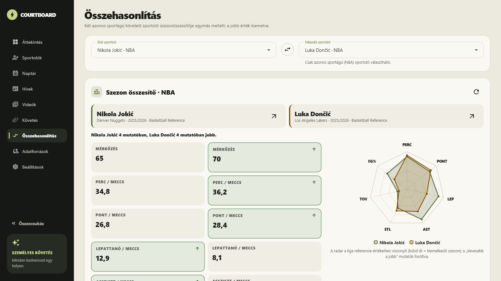
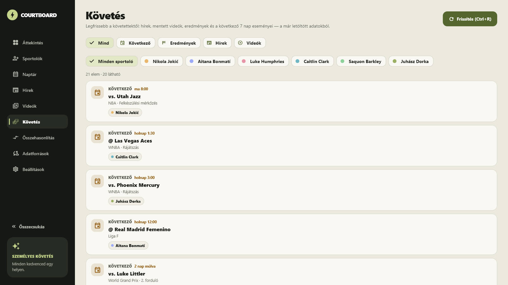
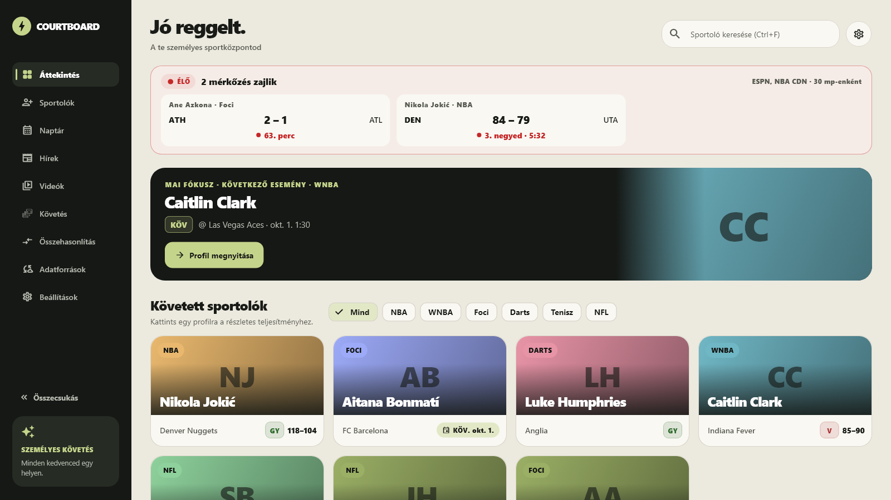
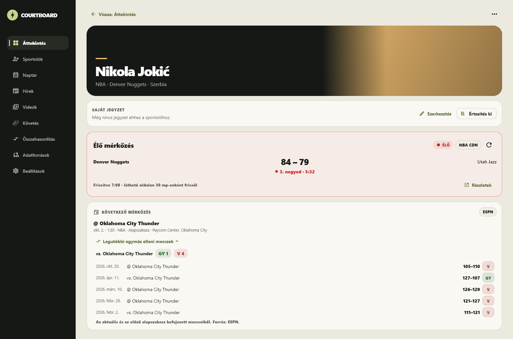
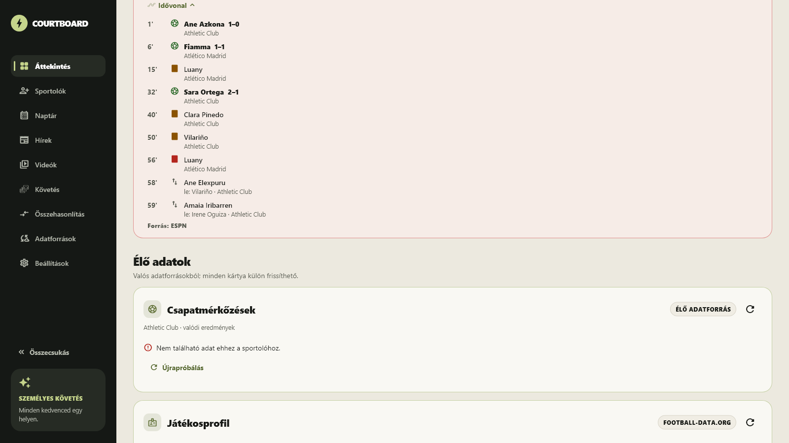

# Courtboard

Windowsos Flutter alkalmazás kedvenc sportolók követésére. Egy sportolói profilt több, egymást kiegészítő adatforrásból épít fel: ha az egyik szolgáltató nem válaszol vagy nem ismeri az adott mezőt, a többi forrás eredménye ettől még megjelenhet.

Az alkalmazás saját **Adatforrás-kézikönyve** kereshető sportág, szolgáltatónév, megjelenő adat, kvóta és cache alapján. Minden kártyán látható:

- mi jelenik meg belőle a Courtboardban;
- mire képes a szolgáltatás, és ebből mit használunk most;
- kell-e kulcs, hol állítható be és mekkora a Free keret;
- mennyi ideig cache-elünk;
- mi történik, ha a forrás hibázik.

## Képernyőképek

### Nyitólap


### Játékosoldal


### Naptár


### Összehasonlítás



### Követés



### Élő eredmények és mérkőzésrészletek







### Sötét mód


> A képernyőképek tesztkörnyezetben, hálózat nélkül készülnek (`test/screenshots`), ezért a fotók helyén a sportoló színéből képzett helyőrző látszik, az élő kártyák a hálózat nélküli állapotot mutatják, a nyitólap eredményei, a naptár eseményei, a hírfolyam elemei és az összehasonlítás szezonszámai pedig mintaadatok. Az élő eredményeket, az egymás elleni mérleget, az idővonalat és az NFL-meccsnaplót bemutató képek a `test/fixtures` mappa (részben valós, 2026. szeptemberi, részben élő állapotra szerkesztett) ESPN-, NBA CDN- és OpenLigaDB-válaszaiból készülnek.

## Felület és személyes beállítások

- Az **Áttekintés** fogaskerék ikonja és a bal oldali **Beállítások** menüpont ugyanazt a beállítási oldalt nyitja meg.
- A megjelenéshez választható a zöld és a bordó kiemelőszín, valamint a **Világos**, **Sötét** vagy **Rendszer** (a Windows beállítását követő) mód.
- **Reszponzív elrendezés:** 1200 px felett teljes, feliratos oldalsáv (a felirat nélküli, ikonos változatra összecsukható, és az app megjegyzi a választást); 800–1200 px között ikonos sáv eszköztippekkel; ennél keskenyebb ablakban hamburger menü nyitja a navigációt. Ultraszéles ablakban a tartalom legfeljebb 1440 px széles, középre zárva. Az ablak legkisebb mérete kb. 800×600.
- **Billentyűparancsok:** `Ctrl+F` keresés, `Esc` vagy `Alt+←` vissza a profilból (és párbeszédablak bezárása), `Ctrl+R` / `F5` frissítés (profil adatkártyái, naptár, hírek), `Ctrl+1…9` menüpontok (Áttekintés, Sportolók, Naptár, Hírek, Videók, Követés, Összehasonlítás, Adatforrások, Beállítások), `Ctrl+N` új sportoló. A teljes lista a **Beállítások → Billentyűparancsok** alatt látható; billentyűzettel bejárva minden kártya, menüpont, chip és gomb jól látható fókuszkeretet kap.
- A nyitólap **Mai fókusz** blokkja a profilokon és a naptárban már betöltött adatokból mutatja a legközelebbi eseményt vagy a legfrissebb eredményt; ha még nincs ilyen, a követett sportolók sportáganként összesítve és gyors műveletek jelennek meg. A kártyák a legutóbbi eredményt is jelzik (például „GY 118–104”), kitalált adat nélkül.
- **Kitűzés:** a nyitólap kártyáján jobb kattintással (vagy hosszú nyomással, `Shift+F10`-zel) nyíló helyi menüben, illetve a profil **Továbbiak** menüjében egy sportoló kitűzhető. A kitűzött sportolók a nyitólapon a saját sorrend előtt, gombostű-jelvénnyel jelennek meg; a választás a helyi állapotfájlba kerül.
- **Formagörbék** a profilokon, kizárólag a már letöltött, valós mérkőzésekből (két adatpont alatt a görbe nem jelenik meg): NBA és WNBA meccsenkénti pont / lepattanó / assziszt választóval és szaggatott szezonátlaggal; foci FotMob-értékelés (ennek hiányában gól + gólpassz); tenisz ranglistapont-történet a helyben, naponta rögzített mérésekből (a Live Tennis API Free csomagja nem ad előzményt); darts és a football-data.org csapateredményei tömör GY/V/D sorként; NFL a csapat pontjai és eredménysora az ESPN befejezett meccseiből (játékosszintű NFL-napló nincs az ingyenes forrásokban). A dátumos tengely, az eszköztipp (ellenfél, eredmény) és a győzelem/vereség színű pontok mellett képernyőolvasónak összefoglaló is jár („Az utolsó 5 meccsen átlag 21,4 pont”).
- **Összehasonlítás** (`Ctrl+7`, vagy a profil **Továbbiak → Összehasonlítás…** pontja): két azonos sportágú követett sportoló szezonösszesítője egymás mellett, a jobb érték kiemelve (az eladott labdánál, lapoknál és ranglista-helyezésnél a kevesebb a jobb), valamint radardiagram a liga referencia-értékeihez normalizálva (például NBA: 35 pont, 15 lepattanó, 12 assziszt). NBA, WNBA, foci és tenisz hasonlítható össze; a darts és az NFL (nincs szezonösszesítő forrás), illetve a különböző sportágak párosítása magyarázatot kap.
- **Követés** (`Ctrl+6`) és a nyitólap „Legfrissebb a követettektől” blokkja: a követettekhez kötődő hírek (a helyi hírarchívumból), mentett videók, a profilokon betöltött eredmények és a következő 7 nap naptáreseményei egy idővonalon, típus- és sportolószűrővel, fokozatos betöltéssel és magyar relatív időkkel („5 perce”, „tegnap”, „holnap 19:30”). A hírfolyam csak tárolt adatból épül; a Frissítés gomb a meglévő szabályokat követi (a hírforrások a 20 perces ablakon belül nem töltődnek újra, a naptár a 6 órás gyorsítótárból jön).
- Az app a rendszer szövegméretét is követi; a fő oldalak 1,3-es nagyításnál sem vágnak le tartalmat.
- Az Áttekintés kártyái és a Sportolók listája egymástól függetlenül rendezhető saját sorrend, név, sportág vagy csapat szerint.
- A **Sportolók** oldalon név szerinti keresés és sportág szerinti szűrés használható.
- A **Naptár** a követett sportolók közelgő mérkőzéseit és eseményeit mutatja napok szerint csoportosítva, sportág- és sportolószűrővel; egy-egy esemény vagy a teljes lista `.ics` fájlként a naptáralkalmazásba vihető (lásd [Naptár és .ics export](#naptár-és-ics-export)).
- Az app induláskor (legfeljebb 12 óránként) megnézi, van-e újabb kiadás a GitHubon; ha igen, egy diszkrét sáv jelzi (lásd [Frissítés-ellenőrzés](#frissítés-ellenőrzés)).
- Az ablak mérete, helye és teljes méretű állapota megmarad; a Courtboard a tálcán is futhat, Windows-értesítést küld meccskezdésről, új eredményről és új hírről, és indulhat a Windows-zal (lásd [Tálca, értesítések és automatikus indítás](#tálca-értesítések-és-automatikus-indítás)).
- A **Videók** médiatár az összes sportolóhoz mentett YouTube-videót egy helyen mutatja; cím, sportoló és sportág szerint szűrhető.
- A **Hírek** oldal RSS-forrásokból és a FOX aktuális NBA-, WNBA-, foci- és tenisz-oldalfeedjeiből épít tartós, cím, sportág, sportoló és forrás szerint kereshető helyi archívumot.
- A választott téma és rendezések automatikusan a helyi állapotfájlba kerülnek.
- A darts sportolóknál nincs csapatmező, ezért az üres vagy „Nincs megadva” csapat nem jelenik meg a kártyákon és profilokon.
- A teniszprofiloknál ugyancsak nincs csapatmező. A Live Tennis API adja az aktuális ranglistát, a játékos alapadatait, az élő állást és a következő mérkőzéseket.

## Gyors indítás Windows alatt

### Már elkészített kiadás használata

Szükséges:

- Windows 10 vagy 11;
- internet az online sportadatokhoz.

Az API-kulcsok opcionálisak: nélkülük is elindul az app, csak kevesebb forrás lesz elérhető.

1. Töltsd le a GitHub Release `Courtboard-...-Windows.zip` fájlját.
2. Csomagold ki a teljes ZIP-et egy írható mappába. Ne csak a `courtboard.exe` fájlt másold ki: a mellette lévő DLL-ek és a `data` mappa is szükséges.
3. Indítsd el a `courtboard.exe` fájlt. PowerShell scriptet nem kell futtatni.
4. Az appban nyisd meg az **Adatforrások** oldalt, és add meg azokat az opcionális kulcsokat, amelyekre szükséged van.
5. Vegyél fel vagy nyiss meg egy sportolót. Az elérhető szolgáltatók automatikusan együtt dolgoznak.

A Basketball Reference integráció közvetlenül Dartban fut, ezért sem Python, sem `.venv`, sem külön csomagtelepítés nem kell hozzá.

### Fordítás forrásból

További szükséges eszközök:

- Flutter SDK 3.44+ (Dart 3.12+);
- Visual Studio a **Desktop development with C++** workload-dal, benne a **C++ ATL for latest build tools** összetevővel (a `flutter_secure_storage` és a `flutter_local_notifications` Windows-pluginjához kell; nélküle a fordítás `C1083: atlbase.h` hibával áll le).

```powershell
flutter pub get
flutter analyze
flutter test
flutter build windows --release
.\start-courtboard.ps1
```

A kiadás futtatható fájlja: `build\windows\x64\runner\Release\courtboard.exe`.
GitHubra a `Release` mappa teljes tartalmát kell ZIP-be csomagolni, a mappaszerkezet megőrzésével.

### MSIX csomag

A ZIP mellett telepíthető MSIX csomag is készíthető. A beállítások a `pubspec.yaml` `msix_config` szakaszában vannak (név: Courtboard, kiadó: Mp3Pintyo, azonosító: `Mp3Pintyo.Courtboard`, képesség: `internetClient`, nyelvek: `hu-hu`, `en-us`, Store nélkül). Az MSIX-verzió a pubspec verziójából jön (`0.11.0+12` → `0.11.0.0`); ezt egy teszt is ellenőrzi.

```powershell
# Release build + MSIX; a kész csomag: dist\Courtboard-<verzió>-Windows-x64.msix
powershell -ExecutionPolicy Bypass -File tool\build_msix.ps1

# Ha a release build már elkészült:
powershell -ExecutionPolicy Bypass -File tool\build_msix.ps1 -SkipBuild

# Saját aláíró tanúsítvánnyal (.pfx):
powershell -ExecutionPolicy Bypass -File tool\build_msix.ps1 -CertificatePath C:\cert\courtboard.pfx -CertificatePassword ****
```

A script a `flutter build windows --release`, majd a `dart run msix:create --build-windows false` parancsot futtatja. **Semmit nem telepít**: sem tanúsítványt, sem alkalmazást.

**Aláírás és telepítés.** Saját tanúsítvány nélkül a `msix` csomag beépített **teszttanúsítványával** (`CN=Msix Testing, O=Msix Testing Corporation…`) aláírt csomag készül. Ezt a Windows alapból nem tekinti megbízhatónak, ezért a dupla kattintásos telepítés hibát jelez. Két lehetőség:

1. **A teszttanúsítvány megbízhatóvá tétele (csak saját, fejlesztői gépen):** a `.msix` fájl *Tulajdonságok → Digitális aláírások → Részletek → Tanúsítvány megtekintése → Tanúsítvány telepítése* lépéseivel a tanúsítványt a **Helyi számítógép → Megbízható személyek** tárolóba kell tenni (rendszergazdai jog kell). Utána a `.msix` dupla kattintással telepíthető. A teszttanúsítvány mindenkinél ugyanaz, ezért éles terjesztésre nem való; használat után a tárolóból törölhető.
2. **Saját tanúsítvány:** a `-CertificatePath` / `-CertificatePassword` paraméterrel saját (például vállalati vagy kereskedelmi kódaláíró) `.pfx` tanúsítvánnyal írd alá; a kiadó (publisher) a tanúsítvány alanyából kerül a csomagba.

A **Fejlesztői mód** (Beállítások → Rendszer → Fejlesztőknek) önmagában nem teszi megbízhatóvá az aláírót; az aláírt csomag telepítéséhez ilyenkor is az 1. vagy a 2. pont kell. Telepítés után a Courtboard a Start menüből indítható, és a *Beállítások → Alkalmazások* alatt távolítható el; a felhasználói adatok (`%APPDATA%`) a ZIP-es változattal közösek.

## API-kulcsok

Egyetlen kulcs sem kötelező az app indulásához.

| Szolgáltató | Mire kell | Beállítás az appban | Környezeti változó | Free keret |
|---|---|---|---|---|
| API-Sports | NBA-profil, foci, korlátozott NFL-integráció | API-Sports | `API_SPORTS_KEY` | 100 kérés/nap, 10/perc; korlátozott szezonok |
| BALLDONTLIE | NBA-profil kiegészítés | BALLDONTLIE | `BALLDONTLIE_KEY` | 5 kérés/perc |
| football-data.org | Free ligák focistáinak alapadatai és támogatott klubok mérkőzései | football-data.org | `FOOTBALL_DATA_KEY` | 12 verseny, 10 kérés/perc |
| RapidAPI Darts API | darts versenylista | RapidAPI (Darts + WNBA) | `RAPIDAPI_KEY` (régi név: `RAPIDAPI_DARTS_KEY`) | 1000 kérés/hó |
| RapidAPI WNBA API | Player Bio és Advanced Statistics | ugyanaz a RapidAPI kulcs | `RAPIDAPI_KEY` (régi név: `RAPIDAPI_DARTS_KEY`) | 100 kérés/hó |
| Live Tennis API | teniszprofil, ranglista, élő és közelgő mérkőzések; egymás elleni mérleg csak BASIC csomaggal | Live Tennis API | `LIVE_TENNIS_API_KEY` | 30 kérés/perc, 100/nap (a 2026. szeptemberi dokumentáció szerint) |
| YouTube Data API v3 | előkészített, még nem aktív automatikus kereső | nincs külön mező | `YOUTUBE_DATA_KEY` | Google-projektkvóta |

A Darts és a WNBA RapidAPI ugyanazt az alkalmazáskulcsot kapja, de a RapidAPI oldalán **mindkét API Free csomagjára külön fel kell iratkozni**.

Az appban elmentett kulcsok (0.15.0-tól) a `flutter_secure_storage` csomaggal, titkosítva kerülnek mentésre: a Windows-változat (`flutter_secure_storage_windows`) az összes kulcsot egyetlen, a Windows DPAPI-jával a felhasználói fiókhoz kötve titkosított JSON-fájlban tartja: `%APPDATA%\Mp3Pintyo\Courtboard\flutter_secure_storage.dat` (a mappanevet az exe verzióadatainak *CompanyName* és *ProductName* mezője adja; MSIX-csomagból futtatva a Windows ezt a csomag saját, virtualizált `AppData` mappájába irányítja). A kulcsok így nem szerepelnek a `%APPDATA%\courtboard_state.json` állapotfájlban, és más felhasználó vagy gép nem tudja visszafejteni őket. A fájl törlése az összes mentett kulcsot törli. Ha az appban mentett kulcs hiányzik, a fenti környezeti változó érvényes.

A 0.9.0–0.14.0 verziók a kulcsokat a Windows Hitelesítőadat-kezelőbe (Credential Manager) írták, `Courtboard/courtboard.api_key.…` néven. Indításkor az app kulcsonként átköltözteti őket: ha az új tárolóban még nincs érték, beírja, visszaolvasással ellenőrzi, és a régi hitelesítő adatot csak akkor törli, ha minden átírás ellenőrzötten sikerült (eltérő visszaolvasásnál a régi marad, és az app onnan olvassa; ha az új tárolóban már van érték, az nyer, így kétszeres költözés nincs). Ha a `flutter_secure_storage` futás közben hibázik (például hiányzó plugin vagy `PlatformException`), az app a bezárásig észrevétlenül a Hitelesítőadat-kezelőt használja tartalékként, és ezt az **Adatforrások** oldal jelzi; a régi kulcsok addig a **Vezérlőpult → Hitelesítőadat-kezelő → Windows hitelesítő adatok** alatt is láthatók.

A 0.9.0 előtti verziók a kulcsokat titkosítatlanul az állapotfájlba írták. Az első indításkor az app ezeket közvetlenül az új, titkosított tárolóba költözteti, visszaolvasással ellenőrzi, és csak ezután törli őket a JSON-ból. Ha sem az új, sem a tartalék tároló nem érhető el, a kulcsok a régi helyükön maradnak, az app memóriából használja őket, az **Adatforrások** oldal pedig figyelmeztetést mutat.

Publikált vagy többfelhasználós kiadásnál kliensbe mentett titkok helyett backend proxyt érdemes használni.

## Adatforrás-mátrix

| Adatforrás | Sport | Mi jelenik meg az appban? | Kulcs | Cache / korlát |
|---|---|---|---|---|
| API-Sports | NBA, NFL, foci | NBA profilmezők; befejezett focimeccsek; elérhető friss szezonoknál focista-összesítő; NFL-válasz alapintegráció | saját | Free 100/nap, 10/perc |
| BALLDONTLIE | NBA | közös NBA-profil kiegészítő mezői | saját | Free 5/perc |
| TheSportsDB | több sport, foci, darts | új sportoló képe; NBA-alapadatok; nem támogatott fociligáknál klubmeccsek; darts profil és utolsó 5 eredmény | publikus `123` | Free legfeljebb 30/perc |
| football-data.org | foci | dinamikusan feloldott játékos klubja, posztja, nemzetisége, születési dátuma, mezszáma és azonosítója; támogatott klubok utolsó 5 meccse | saját | Free 10/perc; csapatkeretek 7 napos lemezcache-ben |
| FotMob | férfi és női foci | aktuális vagy előző szezon: csapat, versenysorozat, értékelés, meccs, gól, gólpassz, sárga és piros lap | nem kell | 6 órás memóriacache; nem hivatalos webes feed |
| SportsDataverse wehoop | WNBA | szezonátlagok (perc, pont, lepattanó, assziszt, labdaszerzés, eladott labda, FG%), forma, box score és utolsó meccsek | nem kell | szezonfájl tartós helyi cache-ben |
| Basketball Reference | NBA, WNBA | NBA aktuális szezonátlagok és alapszakasz + playoff utolsó 5 meccs; WNBA utolsó 5 meccs | nem kell | 6 óra; nem hivatalos webes forrás |
| ESPN `esp.w.1` | női foci | Aitana Bonmatí / Barcelona Femení utolsó 5 befejezett meccse és (a Naptárban) következő meccsei | nem kell | nincs publikált kvóta |
| ESPN csapatmenetrend | NBA, WNBA, NFL | Naptár: a csapat következő meccsei, ellenfél, hazai/idegen, liga és szakasz, helyszín, Gamecast-link; „Legutóbbi egymás elleni meccsek” (aktuális + előző alapszakasz) | nem kell | sportolónként 6 óra, csapatlista 7 nap, előző szezon 7 nap; legfeljebb 30 kérés/perc |
| ESPN játékosadatok (`common/v3` keresés + `gamelog`) | NBA, WNBA, NFL | NFL-játékos meccsnaplója, szezonösszesítője és formagörbéje; NBA/WNBA tartalék (meccsnapló, szezonátlag), ha a Basketball Reference / wehoop nem ad; NFL-összehasonlítás | nem kell | meccsnapló 6 óra, azonosító 7 nap; a közös ESPN 30/perc keretből |
| NBA CDN élő scoreboard | NBA | „Élő” sáv és „Élő mérkőzés” kártya: állás, negyed, óra | nem kell | 45 mp; HTTP 403-nál automatikusan ESPN-tartalék |
| ESPN élő scoreboardok | WNBA, NFL, foci (NBA tartalék) | „Élő” sáv, „Élő mérkőzés” kártya; a mai végeredmény gyorsabb „Új eredmény” értesítése | nem kell | 45 mp; látható oldalon 30 mp-enként |
| ESPN meccsösszefoglaló (`soccer/{liga}/summary`) | foci | lenyitható „Idővonal”: gólok, lapok, cserék perccel | nem kell | befejezett meccs végleges, élő meccs 60 mp |
| OpenLigaDB | Bundesliga, 2. Bundesliga, Frauen-Bundesliga | német csapatok utolsó és következő meccsei, gólszerzők (idővonal), naptár, egymás elleni meccsek – ha a többi forrás nem ad | nem kell | csapatlista 7 nap, szezon-meccslista 1 óra; legfeljebb 30 kérés/perc |
| GitHub Releases | alkalmazás | frissítés-ellenőrzés: a legfrissebb kiadás verziója és oldala | nem kell | 12 óra; hitelesítés nélkül 60 kérés/óra |
| RapidAPI Darts API | darts | legfeljebb 8 versenycímke | RapidAPI | 6 óra; Free 1000/hó |
| RapidAPI WNBA API | WNBA | Bio, csapat, 9 statisztika és legfeljebb 4 díj | RapidAPI | 7 nap; Free 100/hó |
| Live Tennis API | tenisz | ranglista és profiladatok; élő szett-, játék- és pontállás; legfeljebb 5 következő meccs; egymás elleni mérleg (`/h2h`, BASIC) | saját | 10 perc, `/h2h` 7 nap; Free 30/perc és 100/nap |
| FOX Sports JSON-oldalfeed | NBA, WNBA, foci, tenisz | cím, rövid összefoglaló, kép, valódi publikálási dátum és eredeti cikk | nem kell | sportáganként a legfrissebb 100 cikk/frissítés; 20 perc; tartós helyi archívum |
| CBS Sports RSS | NBA, foci, tenisz | cím, rövid összefoglaló, kép, dátum és eredeti cikk | nem kell | 20 perc; tartós helyi archívum |
| ESPN RSS | NBA, WNBA, foci, tenisz | opcionálisan cím, forrás, dátum és kötelező eredeti link | nem kell | 20 perc; külön bekapcsolandó |
| Guardian RSS | foci, tenisz | opcionálisan cím, rövid összefoglaló, kép, dátum és eredeti cikk | nem kell | 20 perc; személyes, nem kereskedelmi használat |
| YouTube oEmbed | videó | kézzel felvett link címe, bélyegképe és megnyitása | nem kell | helyi playlist |
| YouTube Data API v3 | videó | jelenleg semmi; a keresőadapter elő van készítve | saját | még nincs aktív hívás |

## Naptár és .ics export

A **Naptár** a követett sportolók közelgő eseményeit a már bekötött forrásokból gyűjti össze, sportolónként külön, fokozatosan: ami megjött, azonnal látszik, egy forrás hibája pedig csak egy apró megjegyzés az oldal alján (**Forrásmegjegyzések**).

| Sportág | Forrás | Megjegyzés |
|---|---|---|
| NBA, WNBA, NFL | ESPN csapatmenetrend (`site.api.espn.com/…/teams/{csapat}/schedule`) | kulcs nélkül; a csapatot teljes név, rövidítés vagy becenév alapján oldja fel |
| Foci | football-data.org (kulccsal), különben TheSportsDB következő meccsei; német csapatnál, ha ezek nem adnak, az OpenLigaDB | Liga F-tippel mentett sportolónál (Aitana Bonmatí, „Femení” csapat) az ESPN Liga F (`esp.w.1`) |
| Tenisz | Live Tennis API közelgő meccsei és fixture-jei | kulcs kell; kulcs nélkül megjegyzés jelzi |
| Darts | TheSportsDB (a játékos nevét tartalmazó események), RapidAPI Darts (kulccsal, ha a versenylista dátumot is ad) | az ingyenes források ritkán adnak játékosszintű menetrendet |

- Az események **helyi időben**, napok szerint csoportosítva jelennek meg („Ma”, „Holnap”, majd például „okt. 3., szombat”), a következő 45 napra, sportolónként legfeljebb 20 tétellel. A lista sportág és sportoló szerint szűrhető.
- Egy sorban: kezdési idő (bizonytalan időpontnál „később”), sportoló, ellenfél (`vs.` hazai, `@` idegenbeli meccs), bajnokság/szakasz és helyszín, valamint a mérkőzés ESPN/TheSportsDB-oldalának linkje.
- Az eredmény sportolónként 6 órás lemezcache-be kerül (`%APPDATA%\Courtboard\cache\upcoming_events`); a **Frissítés** gomb (`Ctrl+R`) ezt kikerüli. Hálózati hibánál a korábbi lista marad, „régebbi mentett adat” jelzéssel. A kvótás szolgáltatók (Live Tennis API, RapidAPI) a közös kéréskorlátozón és keretszámlálón keresztül kapnak kérést.
- A betöltés induláskor a háttérben is lefut, így a nyitólap **Mai fókusz** blokkja a naptár megnyitása nélkül is a legközelebbi eseményt mutatja.

**.ics export.** Minden eseménynél a **Hozzáadás a naptárhoz** gomb egy egyeseményes `.ics` fájlt ír az ideiglenes mappába (`%TEMP%\courtboard`), és megnyitja az alapértelmezett naptáralkalmazással (Outlook, Windows Naptár…). Az **Összes exportálása** a listában éppen látható eseményeket egyetlen fájlba menti: a mentési ablakban választható a hely (alapnév: `courtboard-naptar.ics`); ha a mentési ablak nem érhető el, a fájl a `%USERPROFILE%\Downloads\courtboard-naptar.ics` helyre kerül. A megjelenő üzenet **Megnyitás** gombja megnyitja a fájlt.

A fájl kézzel írt, RFC 5545 szerinti iCalendar: `PRODID:-//Courtboard//HU`, UTC időpontok, sportág szerinti alapértelmezett hossz (kosárlabda, foci és tenisz 2 óra, NFL 3,5 óra, darts 3 óra), bizonytalan időpontnál egész napos esemény, escape-elt szöveg és 75 bájtos sortördelés. Az esemény azonosítója (`UID`) a forrásból, sportolóból, kezdésből és ellenfélből képzett stabil hash, így ugyanazt az eseményt újra importálva a naptárprogram frissíti, nem duplikálja.

## Élő eredmények, egymás elleni mérleg és idővonal

**Élő eredmények.** A követett sportolók csapatainak mai meccsei kulcs nélkül: NBA-nél az NBA hivatalos CDN-scoreboardja (`cdn.nba.com/…/todaysScoreboard_00.json`; ha egy hálózatról HTTP 403-at ad, automatikusan az ESPN NBA-scoreboardja a tartalék, a forrás jelölésével), WNBA-nél, NFL-nél és focinál az ESPN scoreboardjai (a foci a `soccer/all` napi összesítő, a Liga F az `esp.w.1`). A scoreboardok 45 másodpercig gyorsítótárból jönnek, így a nyitólap, a profil és a háttérfigyelő együtt sem kérdez gyakrabban.

- **Nyitólap:** a lap tetején „Élő” sáv jelenik meg – **csak akkor, ha éppen zajlik** egy követett csapat meccse – állással és negyeddel / perccel; kattintásra megnyílik a sportoló profilja.
- **Profil:** „Élő mérkőzés” kártya (a ma már befejezett meccsnél „Mai mérkőzés · vége”) állással, negyeddel és órával, focinál lenyitható idővonallal.
- A frissítés 30 másodpercenként fut, amíg az oldal látható; ha nincs zajló vagy 20 percen belül kezdődő meccs, 5 percenként. **Szünetel**, ha az ablak a tálcán van vagy kis méretű, illetve ha az oldal nem látható; az oldal elhagyásakor minden időzítő leáll.

**Egymás elleni mérleg.** A naptárban sportolónként a **következő** meccsnél, a profilon a „Következő mérkőzés” sorban lenyitható sáv mutatja (csak lenyitáskor kér adatot):

- **NBA, WNBA, NFL:** „Legutóbbi egymás elleni meccsek” az ESPN csapatmenetrendjéből (az aktuális és az előző alapszakasz), GY–V mérleggel.
- **Foci:** Liga F-nél az ESPN elmúlt egy évéből, német csapatnál az OpenLigaDB idei szezonjából, egyébként a Csapatmérkőzések kártya legutóbbi meccseiből.
- **Tenisz:** a Live Tennis API `/h2h` végpontja (7 napos cache). Ez **BASIC** csomagot igényel: Free kulccsal a válasz 403, ilyenkor a sáv „Nem elérhető a Free csomagban” megjegyzést mutat. (Az app ezt a dokumentált válaszalakra építi; valódi BASIC-kulccsal nem volt ellenőrizhető.)
- **Darts:** a TheSportsDB eredménysoraiból, ha az ellenfél neve szerepel bennük – az ingyenes adat ritkán ad ilyet.

**Foci-idővonal.** A focimeccs-sorokon (Liga F, élő meccs, OpenLigaDB-eredmények és minden sor, ahol ESPN-mérkőzésazonosító ismert) lenyitható **Idővonal** mutatja a gólokat (büntető, öngól jelöléssel és az állással), a sárga és piros lapokat és a cseréket percre pontosan, Material ikonokkal. Forrás: az ESPN meccsösszefoglalója (a befejezett meccs idővonala végleges gyorsítótárba kerül, a zajlóé 60 másodpercig érvényes), OpenLigaDB-meccsnél a gólszerzők a meccslistából.

## Frissítés-ellenőrzés

Induláskor az app a GitHub Releases API-tól (`/repos/mp3pintyo/Courtboard/releases/latest`) lekéri a legfrissebb kiadást, és összeveti a futó verzióval (a Windows-exe verzióadataiból, amelyek fordításkor a `pubspec.yaml`-ből kerülnek bele). Ha újabb, végleges kiadás van, a tartalom tetején diszkrét sáv jelenik meg: „Új verzió érhető el: 0.12.0 – **Letöltés**”; a Letöltés a kiadás GitHub-oldalát nyitja meg. Az app semmit nem tölt le és nem telepít magától.

- A választ 12 órára gyorsítótárazza, így legfeljebb ennyi időnként kérdez; a GitHub hitelesítés nélküli (óránként 60 kéréses) korlátjánál barátságos üzenet jelenik meg.
- Előzetes (prerelease) és vázlat kiadásról nem szól.
- **Beállítások → Frissítések:** a jelenlegi verzió, az **Automatikus frissítés-ellenőrzés** kapcsoló (alapból bekapcsolva, a helyi állapotfájlba mentve) és a **Keresés most** gomb, amely azonnal, cache nélkül ellenőriz és kiírja az eredményt.

## Tálca, értesítések és automatikus indítás

**Ablak.** A Courtboard megjegyzi az ablak méretét, helyét és teljes méretű állapotát, és a következő indításkor ugyanott nyílik meg. A helyzetet fizikai képpontban, a Windows saját `WINDOWPLACEMENT` adatával menti, így több, eltérő nagyítású monitornál is pontos. Ha a mentett hely már nem látható (például leválasztották a második monitort), az ablak az alapméretben (1440×900) középre kerül; a kilógó vagy a monitornál nagyobb ablak a munkaterületre igazodik. Az ablak az első képkocka után, már a mentett helyen jelenik meg (nincs ugrás), a legkisebb mérete kb. 800×600.

**Tálca.** A tálcaikon (eszköztipp: „Courtboard”) bal kattintásra előhozza az ablakot, jobb kattintásra menüt nyit:

- **Megnyitás**
- **Frissítés most** – azonnali háttérellenőrzés (lásd lent)
- **Értesítések szüneteltetése 1 órára** / **Értesítések folytatása**
- **Kilépés**

**Beállítások → Tálca és indítás:**

- **Bezáráskor a tálcára kicsinyítés** (alapból kikapcsolva): az ablak bezárása után az app a tálcán fut tovább, és értesítést is küld. Az első ilyen bezáráskor egyszeri tipp jelzi, hogyan lehet kilépni (tálcaikon → **Kilépés**).
- **Indítás a Windows-zal:** bejelentkezéskor automatikusan elindul (a `HKCU\Software\Microsoft\Windows\CurrentVersion\Run` alatti `Courtboard` érték; rendszergazdai jog nem kell, csak az aktuális felhasználót érinti).
- **Tálcára minimalizálva indul:** Windows-indításkor ablak nélkül, csak a tálcaikonnal indul (`courtboard.exe --minimized`).

**Értesítések.** Az app a háttérben – a tálcán is – figyeli azokat a sportolókat, akiknél a profilon bekapcsoltad az **Értesítés** gombot, és Windows-értesítést küld; kattintásra előjön az ablak, és megnyílik a sportoló profilja (több sportolót érintő hírösszesítőnél a Hírek oldal). Ez akkor is működik, ha az app közben bezárult: a Műveletközpontban hagyott értesítésre kattintva elindul, és a megfelelő oldalon nyílik meg. A sportolós értesítéseken **Profil megnyitása** és **Némítás 1 órára** (az értesítések szüneteltetése, mint a tálcamenüben) gomb, a híreken **Hírek megnyitása** gomb van; ha a sportoló fotója már a képgyorsítótárban van, az értesítés megmutatja. A fő kapcsoló kikapcsolása a még látható Courtboard-értesítéseket is eltünteti.

- **Meccskezdés:** 15 perccel a kezdés előtt, eseményenként egyszer (a már jelzett események újraindítás után sem ismétlődnek). A következő ellenőrzés előtt esedékes kezdésekhez pontos emlékeztető időzítődik.
- **Új eredmény:** NBA-, WNBA- és NFL-sportolóknál az ESPN csapatmenetrendjéből (óránként legfeljebb egy kérés csapatonként); az új eredmény a nyitólap kártyáján is megjelenik. A mai végeredmény az élő scoreboardról (45 mp-es cache) már a menetrend frissülése előtt jelez – focinál ez az egyetlen automatikus eredményforrás. Ugyanaz a meccs a két forrásból csak egyszer jelez.
- **Élő eredményváltozás** (alapból kikapcsolva): zajló meccsen az állás változásakor, ellenőrzésenként legfeljebb egy értesítés meccsenként.
- **Új hír:** a hírfrissítés (forrásonként legfeljebb 20 percenként) után a sportolóhoz kapcsolódó új cikkek; több hír egy összesítő értesítésbe kerül.
- Az **első ellenőrzés** csak megjegyzi a meglévő eredményeket és híreket, így bekapcsoláskor nincs értesítésözön.

**Beállítások → Értesítések:** fő kapcsoló, típusonkénti kapcsolók (meccskezdés, eredmény, élő eredményváltozás, hír), ellenőrzési gyakoriság (5 / 15 / 30 / 60 perc, alapból 15), **Csendes órák** (például 23:00–07:00; ilyenkor és szüneteltetés alatt nem jelenik meg értesítés, és utólag sem pótlódik) és **Teszt értesítés** gomb (a ténylegesen használt megjelenítési módon küld, és a visszajelzés meg is nevezi: „Windows-értesítés”, „Windows-értesítés (MSIX)” vagy „Tálcaértesítés (buborék)”). A háttérellenőrzés a források gyorsítótárát és kvótáját tartja: a menetrend legfeljebb 6 óránként, az eredmények óránként, a hírek 20 percenként frissülnek, akármilyen sűrű is az ellenőrzés.

**Technikai megjegyzések.**

- Ablak: `window_manager` (bezárás elfogása, megjelenítés, események) és közvetlen Win32-hívás (`GetWindowPlacement` / `SetWindowPlacement`). A futtató (`windows/runner`) az első képkockánál már nem jeleníti meg magától az ablakot; ha a Dart oldal 4 mp-en belül nem teszi meg, a futtató tartalékként megjeleníti (kivéve `--minimized` indításnál).
- Tálca: `tray_manager` (a tálcaikon az `assets/tray/app_icon.ico`, a futtató ikonjának másolata).
- Értesítés: `flutter_local_notifications` (Windows: C++/WinRT, FFI), `appName` „Courtboard”, rögzített alkalmazásazonosító (`Mp3Pintyo.Courtboard`) és a kattintást fogadó COM-osztály rögzített GUID-ja (`2d8668a6-7c36-481c-99dd-25e4a414dc60`). A payload az értesítés fajtáját és a sportoló nevét viszi (JSON), ebből lesz a navigáció (`/sportolok/<id>` vagy `/hirek`). Ha a plugin nem inicializálható, vagy egy értesítés megjelenítése hibázik, az app a bezárásig a tálcaikon buborékértesítésével (`Shell_NotifyIcon`) jelez – ez semmilyen regisztrációt nem igényel, de kattintásra csak az ablakot hozza elő. A korábbi `local_notifier` (WinToast) kikerült: a `flutter_local_notifications` minden funkcióját lefedi (gombokkal és indítási adatokkal kiegészítve), ugyanarra a Windows-toast infrastruktúrára épül (így ugyanott hibázna), és a Start menüben parancsikont hozott létre.
- **Nem csomagolt futtatásnál** (zip, `flutter run`) az inicializálás a `HKCU\Software\Classes\AppUserModelId\Mp3Pintyo.Courtboard` kulcsba írja az app nevét, ikonját és a COM-osztályt, a Courtboard pedig a `HKCU\Software\Classes\CLSID\{2d8668a6-…}\LocalServer32` alá az exe útvonalát (`"…\courtboard.exe" -ToastActivated`), hogy a bezárt app is elinduljon egy értesítésre kattintva. Itt a Windows nem engedi egyenként visszavonni a már megjelent értesítéseket (csak mindet törölni); ugyanazzal az azonosítóval küldött új értesítés viszont felváltja a régit.
- **MSIX-csomagnál** az azonosítót és a COM-kiszolgálót a manifest adja (`pubspec.yaml` → `msix_config.toast_activator`, ugyanazzal a GUID-dal), a registry-bejegyzés nem kell, és az egyenkénti visszavonás is működik.
- A `flutter_secure_storage` és a `flutter_local_notifications` Windows-változata fordításkor a Visual Studio „C++ ATL” összetevőjét igényli (lásd az előfeltételeket); a `launch_at_startup` csomag újabb változatai a `win32` 5-öt kérik (az app a 6-ost használja), ezért a Windows-zal indítás közvetlen `advapi32`-hívással készült.
- **MSIX-csomagnál** a rendszerleíró adatbázis virtualizált, ezért ott az **Indítás a Windows-zal** kapcsoló nem használható; a csomagolt appot a Windows *Beállítások → Alkalmazások → Indítás* oldalán lehet automatikus indításra állítani.

## Hogyan dolgoznak együtt sportáganként?

### NBA

Az API-Sports, a BALLDONTLIE és a TheSportsDB profilhívásai egymástól függetlenül futnak, majd egy közös profilba kerülnek. Egyikük hibája nem dobja el a többiek eredményét. A Basketball Reference közvetlen Dart HTML-feldolgozása adja az aktuális NBA alapszakasz per-game összesítőjét: mérkőzés, perc, pont, összes lepattanó, assziszt, labdaszerzés, eladott labda és FG%. Ugyanez a kliens egészíti ki a profilt az alapszakasz és a rájátszás utolsó öt meccsével. Az ESPN kulcs nélküli játékosvégpontjai (keresés + meccsnapló, 6 órás cache) kiegészítő és tartalékforrásként futnak: az „ESPN” chip a forrásállapotok között látszik, és ha a Basketball Reference nem ad meccsnaplót vagy szezonátlagot (például ideiglenes tiltás), az ESPN-é jelenik meg – a forrás feliratával.

### WNBA

A wehoop adja a teljes aktuális alapszakasz box score-jait. Ezekből az app valódi meccsenkénti átlagot számol a játszott percre, pontra, összes lepattanóra, asszisztra, labdaszerzésre és eladott labdára; az FG% a teljes bedobott és megkísérelt mezőnydobás arányából készül. A wehoop adja továbbá a formaadatot, a meccseket és az ESPN játékosazonosítót. A névfeloldás ékezet- és névsorrend-független, ezért például a `Juhász Dorka` bevitel a `Dorka Juhasz` ESPN-rekordhoz és a `4398938` azonosítóhoz illeszkedik. A Basketball Reference külön utolsó 5 meccses forrás. Ha a wehoop szezonfájlja nem érhető el vagy a játékos nem szerepel benne, a meccsnapló és a szezonátlag az ESPN játékos-meccsnaplójából jön (a kártya ezt megjegyzésben jelzi). Ha a RapidAPI WNBA előfizetés és kulcs is rendelkezésre áll, az app hozzáadja a Player Bio, Advanced Statistics és díjadatokat, köztük az elérhető `TO`/`TOV` mutatót is. A Bio és Advanced hívás egymás után fut, hogy csökkentse a `429 Too Many Requests` hibák esélyét.

### Foci és női foci

Az API-Sports Free kompatibilis, `season` alapú mérkőzéslekérést használ. Nem küld `last` paramétert, mert az a Free csomagban hibát okoz. A focisták **Szezon összesítő** kártyájához az app megpróbálja az API-Sports játékosstatisztikáját is felhasználni. Mivel a Free csomag jelenleg csak régebbi szezonokat enged, a friss adatokat a kulcs nélküli FotMob feed egészíti ki. Csak a naptári év szerinti aktuális vagy előző szezon fogadható el; régebbi adat nem jelenik meg frissként. Azonos csapat és versenysorozat esetén a két forrás mezői összeolvadnak.

A szezonkártyán a csapat, versenysorozat, értékelésátlag, játszott mérkőzések, gólok, gólpasszok, sárga és piros lapok látszanak. A névfeloldás az ékezeteket és a keresztnév–vezetéknév sorrendet is kezeli. A football-data.org adapter már nem beégetett csapatazonosítókból dolgozik: a Free csapatlistában dinamikusan oldja fel a klubot, majd az aktuális keretben név alapján keresi meg a játékost. A profilkártyán klub, poszt, nemzetiség, születési dátum, mezszám és football-data.org játékosazonosító jelenhet meg. A 12 Free `TIER_ONE` verseny keretei 7 napos lemezcache-be kerülnek, a lekérések pedig a 10 kérés/perces korláthoz igazodnak.

A football-data.org Free csomag nem ad játékosonkénti meccsaggregációt, ezért a gól-, gólpassz-, lap- és értékelésadatokat továbbra is a FotMob vagy az API-Sports egészíti ki. Ha egy klub ligája nem része a football-data.org Free kínálatának – ilyen az MLS és az Inter Miami –, a csapat utolsó és következő mérkőzéseit a kulcs nélküli TheSportsDB fallback tölti be. Az ESPN-bajnokságkóddal mentett profiloknál (alapból Aitana Bonmatí a Liga F-ben, `esp.w.1`; új sportolónál a „Femení” / „Femenino” utótagú csapatnév) az általános ESPN-csapatforrás a bajnokság scoreboardjából a sportoló csapatának meccseit szűri – bármely ESPN-ben szereplő női vagy férfi bajnokságban; Aitanánál a Barcelona Femení meccseit, férfi Barcelona-eredmény nélkül. Német csapatnál (Bundesliga, 2. Bundesliga, Frauen-Bundesliga), ha a többi forrás nem ad eredményt vagy menetrendet, a kulcs nélküli **OpenLigaDB** pótolja – a gólszerzőkkel együtt, amelyek a meccssor „Idővonal” sávjában látszanak.

### Darts

A TheSportsDB adja a játékosprofilt és az utolsó 5 eredményt. A Sportbex RapidAPI Darts API a versenykínálatot egészíti ki. Bár az API eseményeket, piacokat és oddsokat is kínál, a Courtboard jelenleg csak a `competitions/3503` végpontot jeleníti meg.

### NFL

A **Játékos-meccsnapló** kártya az ESPN kulcs nélküli játékosvégpontjaiból (keresés szigorú névegyezéssel, meccsnapló 6 órás cache-sel) valódi, játékosonkénti adatot ad: szezonösszesítő a szerepkörhöz illő mutatókkal (passzolt / futott / elkapott yard, TD, INT, passz%, QB rating, szerelés), formagörbe a pozíció fő mutatójából (irányítónál passzolt, futónál futott, elkapónál elkapott yard) szezonátlag-vonallal, és a legutóbbi meccsek. Az NFL-játékosok ebből az **Összehasonlítás** oldalon is összevethetők (meccsenkénti átlagok; csak a mindkettőjüknél létező mutató kerül a radarra). Az API-Sports adapter kulccsal továbbra is fut. A profil **Csapatforma** kártyája az ESPN kulcs nélküli menetrendjéből (60 perces gyorsítótárral) a csapat legutóbbi befejezett mérkőzéseit mutatja pontgörbével és GY/V sorral.

### Tenisz

Új sportoló felvételekor válaszd a **Tenisz** sportágat; csapatot nem kell megadni. A Live Tennis API kulcsa az **Adatforrások** oldalon menthető. A név szerinti játékoskeresés ékezet- és névsorrend-független, majd a részletes profilból az app megjeleníti az aktuális ranglistát, ranglistapontot, sorozatot, országot, ütőkezet, fonákot és születési dátumot.

Az élő mérkőzésnél az ellenfél, a verseny, a szett-, játék- és pontállás látható. A közelgő meccseket az azonosítóval rendelkező upcoming feed és a név alapú fixture lista együtt tölti ki. A játékos saját sorozatkódját csak akkor küldjük szűrőként, ha egyértelműen `atp` vagy `wta`, mert az alsóbb sorozatok profilkódjai eltérnek az API szűrőértékeitől.

A Free csomaghoz nem tartozó `completed`, `/history`, piac-, modell- és WebSocket-végpontokat az app nem hívja; az egymás elleni mérleg (`/h2h`, BASIC) csak a sáv lenyitásakor kér, és Free kulcsnál „Nem elérhető a Free csomagban” jelzést ad. Egy profil friss betöltése legfeljebb öt kvótás kérést használ, a `/usage` ellenőrzés kvótamentes; a 10 perces lemezcache védi a napi keretet (a 2026. szeptemberi dokumentáció szerint 100 kérés/nap, a helyi számláló ehhez igazodik). A kézi frissítés tudatosan megkerüli a cache-t.

### Hírek és tartós hírarchívum

A **Hírek** oldal alapból a FOX Sports és a CBS Sports NBA-, WNBA-, foci- és teniszforrásait dolgozza fel. A FOX optimalizált RSS-feedjei egyenetlenek voltak: a WNBA legújabb eleme hónapokkal korábbi, a teniszfeed pedig több éves cikkeket is tartalmazott. Ezért mind a négy FOX sportág a FOX weboldalak által is használt aktuális JSON-hírfolyamból érkezik. Sportáganként kérésenként a legfrissebb 100 cikket kapjuk; a helyi archívum az újabb frissítésekkel tovább növekszik. A forráskezelőben az ESPN és a Guardian feedjei külön kapcsolhatók be.

A helyi adatbázis mindig azonnal betöltődik, a hálózati frissítés csak utána fut, ezért egy hibás vagy átmenetileg nem elérhető forrás nem tünteti el a korábbi híreket. A kártyán mindig a cikk publikálási dátuma jelenik meg, nem a letöltés ideje. Az adatbázis-migráció eltávolítja az első kiadás FOX-elemeit, amelyeknél a hibás időzóna-feldolgozás miatt a lekérési idő került publikálási dátumként tárolásra; a következő frissítés helyes dátummal tölti vissza őket.

- Az automatikus frissítési ablak 20 perc; a Frissítés gomb tudatosan megkerüli ezt az időkorlátot.
- A letöltött hírek helyi SQLite-adatbázisba kerülnek (`%APPDATA%\Courtboard\courtboard_news.sqlite`), így hónapokkal később és hálózat nélkül is kereshetők maradnak. Takarítás csak a megőrzési szabály szerint van: egy cikk akkor törlődik, ha egy évnél régebbi **és** nincs a legújabb 5000 között (a sport- és forráskapcsolatok és a keresőindex vele együtt törlődnek).
- Az adatbázist a 0.14.0 óta a [drift](https://drift.simonbinder.eu/) kezeli (típusos, reaktív lekérdezések, háttér-isolate). A séma a korábbi (sqflite) tárral azonos, ezért a meglévő archívum frissítéskor adatvesztés és átalakítás nélkül nyílik meg: a drift az 5-ös sémaverzióval csak átveszi a 4-es sémát, a régebbi (2–3-as) adatbázisokon pedig a korábbi migrációs lépések futnak le. A Hírek oldal és a Követés hírfolyam élőben frissül, ha a háttérfigyelő új cikket ment.
- A deduplikáció elsősorban kanonizált URL, ennek hiányában GUID alapján történik. Egy hír több sportághoz és több feedhez is kapcsolódhat anélkül, hogy duplán jelenne meg.
- A feldolgozó kezeli az RSS, Atom és FOX JSON eltéréseit, az RFC 822 numerikus időzóna-eltolásokat, valamint az ESPN `EST`/`EDT` jelöléseit. A leírás HTML-entitásait dekódolja, eltávolítja a `script`, `style`, `noscript` elemeket és a tageket, normalizálja a whitespace-t, majd legfeljebb 350 karaktert tárol.
- A keresés a címben és az összefoglalóban fut, SQLite FTS5 `trigram` indexszel (részszó-keresés, legalább 3 karakter); rövidebb keresésnél, vagy ha a beépített SQLite nem ismerné az FTS5-öt, `LIKE` keresés fut. A sportoló szerinti illesztés ékezet- és névsorrend-független tokenekkel működik.
- A tárolt kép az RSS-ben kapott külső kép-URL; maga a képfájl nincs archiválva. A cím, összefoglaló, dátum, forrás és eredeti link viszont tartósan megmarad.
- A hírmodell egy `NewsProvider` interfészen keresztül kap adatot, ezért később RSS mellett hírszolgáltatói API vagy más importforrás is hozzáadható az adatbázis és a felület átírása nélkül.

Az ESPN-tartalomnál a Courtboard csak a feed által átadott címet és metaadatokat használja, jól láthatóan feltünteti a forrást, és mindig az eredeti ESPN-cikkre linkel. Az ESPN-feed köré nem szabad reklámot helyezni. A Guardian feedjei személyes, nem kereskedelmi használatra kapcsolhatók be. A FOX és más szolgáltatók feltételei változhatnak; nyilvános vagy üzleti terjesztés előtt a mindenkori felhasználási feltételeket újra ellenőrizni kell.

## Profilképek és videók

Új sportoló felvételekor a TheSportsDB név szerinti keresése próbál profilképet találni. Ha nincs találat, az app a sportoló színéből képzett, monogramos helyőrzőt mutat.

A képek (profilfotók, videó-bélyegképek, hírképek) a megjelenített mérethez igazítva dekódolódnak, és lemezre mentve 30 napig offline is elérhetők (`%APPDATA%\Courtboard\cache\images`); letöltési hibánál a korábban mentett példány marad látható.

A sportolói profilon a felhasználó YouTube URL-t vagy videóazonosítót adhat meg. A cím és bélyegkép a kulcs nélküli YouTube oEmbed válaszból érkezik. A mentések a központi **Videók** oldalon is megjelennek, ahol cím, sportoló és sportág szerint kereshetők, lejátszhatók vagy eltávolíthatók. A Courtboard nem ír a YouTube-fiókba, és nem hoz létre távoli playlistet. A YouTube Data API keresőadaptere létezik, de jelenleg nincs bekötve automatikus keresési felületre.

## Helyi adatok és cache-ek

| Fájl vagy mappa | Tartalom | Élettartam |
|---|---|---|
| `%APPDATA%\courtboard_state.json` | saját sportolók, jegyzetek, figyelések, API-kulcsok, téma és rendezési beállítások | amíg a felhasználó nem törli |
| `%APPDATA%\courtboard_playlist.json` | mentett YouTube videóazonosítók | amíg a felhasználó nem törli |
| `%APPDATA%\courtboard\wnba_cache` | wehoop WNBA szezon CSV-k | tartós |
| `%APPDATA%\courtboard_cache\basketball_reference` | NBA/WNBA meccsek | 6 óra |
| `%APPDATA%\courtboard_cache\rapidapi_darts` | darts versenylista | 6 óra |
| `%APPDATA%\courtboard_cache\rapidapi_wnba` | WNBA bio és advanced stat | 7 nap; hibánál a régebbi mentés is használható |
| `%APPDATA%\courtboard_cache\football_data\free_players.json` | football-data.org Free csapatkeretek és játékos-alapadatok | 7 nap; hálózati hibánál a régebbi mentés is használható |
| `%APPDATA%\courtboard_cache\live_tennis` | teniszprofil, élő és közelgő mérkőzések, kvótaállapot | 10 perc |
| `%APPDATA%\Courtboard\cache\images` | profilfotók, videó-bélyegképek és hírképek | 30 nap; hibánál a régebbi példány is használható, 90 nap után törlődik |
| `%APPDATA%\Courtboard\cache\highlights` | a profilokon és a naptárban betöltött legutóbbi eredmények (legfeljebb 6) és következő esemény sportolónként (a nyitólaphoz és a Követés hírfolyamhoz) | a következő betöltésig |
| `%APPDATA%\Courtboard\cache\ranking_history` | teniszezők ranglista-helyezése és -pontja, naponta legfeljebb egy mérés (a formagörbéhez) | legfeljebb 90 mérés játékosonként |
| `%APPDATA%\Courtboard\cache\upcoming_events` | a naptár közelgő eseményei sportolónként | 6 óra; hibánál a régebbi lista is használható |
| `%APPDATA%\Courtboard\cache\espn` | ESPN NBA/WNBA/NFL csapatlisták; a háttérfigyelő befejezett mérkőzései; az előző szezon eredményei (egymás elleni mérleg) | csapatlista 7 nap, eredmények 60 perc, előző szezon 7 nap |
| `%APPDATA%\Courtboard\cache\espn_athletes` | ESPN játékosazonosítók és meccsnaplók (NFL, NBA/WNBA tartalék) | napló 6 óra, azonosító 7 nap (sikertelen keresés 24 óra) |
| `%APPDATA%\Courtboard\cache\live_scores` | NBA CDN / ESPN napi scoreboardok | 45 mp |
| `%APPDATA%\Courtboard\cache\match_timeline` | ESPN foci-meccsösszefoglalók idővonala | befejezett meccs végleges, zajló 60 mp |
| `%APPDATA%\Courtboard\cache\openligadb` | OpenLigaDB csapatlisták és szezon-meccslisták | csapatlista 7 nap, meccslista 1 óra |
| `%APPDATA%\Courtboard\cache\watcher` | a háttérfigyelő emlékezete: már jelzett meccskezdések, látott eredmények és hírek | a jelzett események 2 napig; törlés után az első ellenőrzés csak újra megjegyzi a meglévőt |
| `%APPDATA%\Courtboard\cache\update_check` | a legfrissebb GitHub-kiadás adatai | 12 óra |
| `%APPDATA%\Courtboard\courtboard_news.sqlite` | letöltött hírek, sport- és forráskapcsolatok, feedbeállítások és frissítési állapot (drift / SQLite, FTS5 keresőindex) | tartós; csak az egy évnél régebbi, a legújabb 5000-en kívüli cikkek törlődnek |

## Hibaelhárítás

### `free plans do not have access to the Last parameter`

Friss buildet használj. A focilekérés már nem küldi a Free csomagban tiltott `last` paramétert, hanem támogatott szezonból kér befejezett mérkőzéseket.

### `429 Too Many Requests`

Elérted a szolgáltató percenkénti vagy havi kvótáját. Várj a kvótaablak végéig. A WNBA RapidAPI-hívások szekvenciálisak, a kis keretű szolgáltatások pedig lemezcache-t használnak.

### Nincs NBA/WNBA utolsó mérkőzés

Ellenőrizd az internetkapcsolatot, majd indítsd újra az appot. A Basketball Reference közvetlenül az oldal HTML-tábláit tölti le; Python nem szükséges. Friss hálózati válasz hiányában az app a korábbi lemezcache-t próbálja használni, majd a többi NBA/WNBA-forrásra esik vissza.

### Egy API-kulcs hiányzik

Az app ettől még működik. Az **Adatforrások** oldalon a kártya `KULCS HIÁNYZIK` állapotot mutat, és részletesen leírja, mely adatok maradnak el. A kulcsot ott helyben elmentheted, vagy felhasználói környezeti változóként is beállíthatod, például:

```powershell
[Environment]::SetEnvironmentVariable('API_SPORTS_KEY', 'SAJAT_KULCS', 'User')
```

Környezeti változó módosítása után indítsd újra az alkalmazást.

### Egy hírforrás nem frissül

A **Hírek → Források** ablakban ellenőrizd, hogy a feed be van-e kapcsolva, és nézd meg az utolsó sikeres frissítés vagy hiba állapotát. A korábban letöltött archívum feedhiba esetén is megmarad. Automatikusan legfeljebb 20 percenként kér új adatot az app; az azonnali újrapróbáláshoz használd a **Frissítés** gombot.

## Fejlesztői ellenőrzés

```powershell
dart format lib test
# csak a lib/data/news/news_database.drift vagy news_database.dart módosításakor:
dart run build_runner build
flutter analyze
flutter test
flutter build windows --release
```

A drift generált kódja (`lib/data/news/news_database.g.dart`) a tárolóban van, ezért a fordításhoz nem kell a kódgenerátort futtatni; a beállítása a `build.yaml`-ban van.

Az adatforrások központi, kereshető leírása a `lib/data/provider_catalog.dart` fájlban van. Új integráció felvételekor ezt a katalógust és a README mátrixát együtt kell frissíteni.

## Kódszerkezet

A 0.13.0 óta minden fájl önálló Dart-könyvtár (nincs `part of`); a `lib/` fájljai egymást mindig `package:courtboard/...` importtal érik el (az `always_use_package_imports` lint őrzi). A fájlok közötti nyilvános API-t a szimbólumnevek adják, a csak egy fájlban használt segédek privátok (`_`) maradnak.

```text
lib/
  main.dart            belépési pont: állapot és kulcsok betöltése, AppServices,
                       ProviderScope(overrides: courtboardOverrides(...)) + CourtboardRoot
  app/                 az alkalmazás kerete
    courtboard_app.dart    CourtboardRoot (MaterialApp.router, téma); CourtboardApp:
                           ProviderScope egyedi paraméterekből (tesztekhez)
    providers.dart         alkalmazásszintű providerek, courtboardOverrides()
    router.dart            go_router: StatefulShellRoute, ágak, profil-útvonal
    app_location.dart      útvonal ↔ navigációs állapot (AppLocation), útvonal-építők
    route_pages.dart       az útvonalak oldalai (providerekből építik a funkciók widgetjeit)
    courtboard_shell.dart  shell: oldalsáv / fiók, frissítés-sáv, billentyűparancsok,
                           ShellActions / ShellScope (navigáció és közös párbeszédablakok)
    app_controller.dart    AppController (ChangeNotifier): sportolók (stabil azonosítóval),
                           sorrend, kitűzés, jegyzetek, értesítésjelölés, beállítások,
                           API-kulcsok, videólista, mentés a LocalStateStore-ba
    activity_controller.dart  kiemelések, hírfolyam, naptár (nyitólap, Követés)
    desktop_coordinator.dart  tálca, ablak, Windows-indítás, értesítések, háttérfigyelő
    app_services.dart      AppServices: platformszolgáltatások és tesztcsatlakozók → overrides
    app_page.dart          AppPage enum (felirat, ikon, útvonal, Ctrl+1…9, „Vissza” felirat)
    navigation.dart        oldalsáv, töréspontok, tartalomkeret
    shortcuts.dart         billentyűparancsok (Intent-ek)
    seed_data.dart         az alapból követett sportolók
  domain/              UI-független modell
    sport.dart             Sport enum (felirat, ikon, csapatsport, szín; JSON = régi magyar szöveg)
    athlete.dart           Athlete (stabil `id`), rendezés
    athlete_id.dart        azonosító a névből (`nikola-jokic`), ütközésfeloldás
    athlete_source_hints.dart  adatforrás-tippek (ESPN-liga, csapat, felirat) és migráció
    athlete_targets.dart   Athlete → naptár/élő eredmény célpont
  features/            képernyők funkció szerint
    dashboard/  athletes/  calendar/  news/  videos/  follow_feed/
    compare/  data_sources/  settings/  live_scores/
    profile/               profiloldal, közös profilelemek, formagörbék,
      sport_profile_spec.dart  sportágankénti regiszter (élő kártyák, sablon,
                               formagörbe fajtája, egymás elleni mérleg, összehasonlítás)
      profile_form.dart        SportFormChart: a FormChartKind választja a görbét
      profile_providers.dart   sportolónkénti adatok (FutureProvider / AsyncNotifier családok)
      sports/              sportágankénti adatkártyák (NBA, WNBA, foci, tenisz, darts, NFL)
  shared/              közös UI: components (DataSourceCard, AsyncDataSourceCard …),
                       charts, format, images (imageDiskCacheProvider), common_ui, theme/
  data/                adatforrások, gyorsítótárak, tárolók (UI nélkül)
    providers.dart         az adatréteg providerei (HTTP, gyorsítótárak, repositoryk)
    news/                  hírarchívum: modellek, forráslista, feldolgozók, repository
      news_store.dart          NewsStore: mentés (upsert), megőrzés, FTS5/LIKE keresés,
                               lapozás, watchArticles / watchCount / watchSourceStates
      news_database.drift      a séma (a régi sqflite-tárral azonos nevek) és a típusos
                               lekérdezések (upsert, kapcsolósorok, megőrzés)
      news_database.dart       NewsDatabase (drift): migráció 2/3/4 → 5, FTS5 index és
                               triggerek, forráslista; news_database.g.dart: generált
  desktop/             Windows-integráció (ablak, tálca, értesítések, indítás)
```

Függőségi irány: `app` → `features` → `shared` / `domain` / `data`. A sportág mindenhol a `Sport` enum; a mentett állapot és a gyorsítótárak továbbra is a régi szöveges értéket (`NBA`, `Foci` …) tárolják, így a korábbi mentések változatlanul betölthetők. Új sportág felvételekor a `Sport` enumot és a `SportProfileSpec.registry`-t kell bővíteni.

### Állapot és függőségek (Riverpod)

Az app `ProviderScope`-ban fut (`flutter_riverpod`, kódgenerálás nélkül). A `main` az `AppServices`-ből és az indításkor betöltött állapotból (`AppLaunchState`) állítja össze a felülírásokat (`courtboardOverrides`); a tesztek ugyanezt a `CourtboardApp` paramétereivel vagy közvetlen `ProviderScope(overrides: [...])`-szal teszik. Az automatikus újrapróbálás ki van kapcsolva (`noAutomaticRetry`): a hibát a kártya mutatja „Újrapróbálás” gombbal.

| Provider | Hol | Mit ad |
|---|---|---|
| `appServicesProvider`, `appLaunchProvider` | `app/providers.dart` | indításkor összeállított szolgáltatások, mentett állapot és kulcsok, kezdő útvonal |
| `appControllerProvider` | `app/providers.dart` | `AppController` (`ChangeNotifierProvider`; szűkebb figyeléshez `select`) |
| `activityControllerProvider` | `app/providers.dart` | kiemelések, hírfolyam, naptár |
| `desktopCoordinatorProvider` | `app/providers.dart` | tálca, értesítések, háttérfigyelő (üzenetek és kattintások folyamként) |
| `appVersionProvider`, `updateCheckerProvider`, `desktopIntegrationProvider`, `startupRegistrationProvider`, `watcherSourceProvider`, `watcherMemoryStoreProvider` | `app/providers.dart` | platformszolgáltatások |
| `routerProvider` | `app/router.dart` | a `GoRouter` |
| `httpServiceProvider`, `cacheStorageProvider`, `highlightStoreProvider`, `rankingHistoryStoreProvider` | `data/providers.dart` | közös HTTP-réteg és gyorsítótárak |
| `apiConfigProvider`, `sportsApiClientProvider` | `data/providers.dart` | az aktuális kulcsok (az appban az `AppController`-é) |
| `newsRepositoryProvider`, `notificationServiceProvider`, `upcomingEventsControllerProvider` | `data/providers.dart` | hírarchívum, értesítések, naptárvezérlő |
| `espnAthleteRepositoryProvider`, `espnScheduleRepositoryProvider`, `espnSoccerTeamRepositoryProvider`, `liveScoresRepositoryProvider`, `matchTimelineRepositoryProvider`, `headToHeadRepositoryProvider`, `upcomingEventsRepositoryProvider`, `basketballReferenceRepositoryProvider`, `wnbaWehoopRepositoryProvider`, `openLigaDbRepositoryProvider` | `data/providers.dart` | kulcs nélküli repositoryk |
| `apiSportsRepositoryProvider`, `multiProviderAthleteRepositoryProvider`, `dartsRepositoryProvider`, `footballSeasonRepositoryProvider`, `footballDataRepositoryProvider`, `footballDataPlayerRepositoryProvider`, `tennisRepositoryProvider`, `wnbaRapidApiRepositoryProvider` | `data/providers.dart` | kulcsos repositoryk (kulcsmentéskor újak) |
| `profileImageResolverProvider` | `data/providers.dart` | profilkép keresése új sportolóhoz |
| `imageDiskCacheProvider` | `shared/images.dart` | a képek lemezes tára (alapból `ImageDiskCache.shared`, amely híd a `ProviderScope` nélküli helyekre) |
| `compareSourceProvider` | `features/compare/compare_data.dart` | az Összehasonlítás szezonadat-forrása |
| `nextEventsProvider` (FutureProvider család) | `features/profile/profile_providers.dart` | „Következő mérkőzés” sportolónként |
| `nbaSeasonSummaryProvider`, `nflGameLogProvider`, `nflTeamFormProvider`, `espnSoccerTeamGamesProvider`, `tennisProfileProvider`, `wnbaGamesProvider` (AsyncNotifier családok) | `features/profile/profile_providers.dart` | adatkártyák; `refresh()` kényszerít (gyorsítótár nélkül), `ref.invalidate` gyorsítótárból épít újra |
| `apiSportsCardProvider`, `dartsProfileProvider`, `footballSeasonProvider`, `footballTeamGamesProvider`, `footballDataPlayerProvider`, `wnbaBasketballReferenceProvider`, `wnbaRapidProfileProvider` (FutureProvider családok) | `features/profile/profile_providers.dart` | adatkártyák kényszerített betöltés nélkül; a frissítés `ref.invalidate` |

A 0.14.0 óta minden profilkártya providerből kapja az adatát, és `AsyncDataSourceCard`-dal jelenik meg; az API-kulcstól függő kártyák a kulcsot `select`-tel figyelik, így csak annak változásakor töltenek újra. A jövőalapú `DataSourceCard` az Összehasonlítás oldalon és önálló kártyákhoz maradt meg.

### Útvonalak (go_router)

A menüpontok egy `StatefulShellRoute.indexedStack` ágai: az oldalsáv a shellben marad, az ágak (görgetés, szűrők, keresés, összehasonlítás-kiválasztás) oldalváltáskor és profil megnyitásakor is megmaradnak. A lapok átmenet nélkül váltanak. A háttérben megtartott ágak nem kapják meg a Ctrl+R / Ctrl+F parancsokat, és az élő eredmények sem frissülnek bennük (`TickerMode`).

| Útvonal | Oldal | Billentyű |
|---|---|---|
| `/` | Áttekintés | Ctrl+1 |
| `/sportolok` | Sportolók | Ctrl+2 |
| `/sportolok/:athleteId?from=<menüpont>` | profil; a `from` a kiinduló menüpont (kiemelés, „Vissza: …”, Esc / Alt+←) | – |
| `/naptar` | Naptár | Ctrl+3 |
| `/hirek` | Hírek | Ctrl+4 |
| `/videok` | Videók | Ctrl+5 |
| `/kovetes` | Követés | Ctrl+6 |
| `/osszehasonlitas?a=<id>&b=<id>` | Összehasonlítás (a kiválasztás az útvonalban) | Ctrl+7 |
| `/adatforrasok` | Adatforrások | Ctrl+8 |
| `/beallitasok` | Beállítások | Ctrl+9 |

Az `athleteId` a sportoló stabil azonosítója (a névből: `nikola-jokic`; a saját sportolóknál mentett adat, a régi mentések a névből kapják meg). Ismeretlen azonosítónál a router a Sportolók oldalra irányít. Értesítésre kattintva a router nyitja meg a sportoló profilját (`/sportolok/<id>`), hírösszesítőnél a `/hirek` oldalt. Az `AppPage` enum adja a menüpontok feliratát, ikonját, útvonalát és billentyűparancsát.

## Szolgáltatói dokumentáció

- [API-Sports / API-Football árak és Free csomag](https://www.api-football.com/pricing)
- [BALLDONTLIE](https://www.balldontlie.io/)
- [TheSportsDB dokumentáció](https://www.thesportsdb.com/documentation)
- [football-data.org](https://www.football-data.org/client/register)
- [SportsDataverse](https://github.com/sportsdataverse/sportsdataverse-py)
- [Basketball Reference](https://www.basketball-reference.com/)
- [RapidAPI Darts API](https://rapidapi.com/sportbex-api-default-api/api/darts-api)
- [RapidAPI WNBA API](https://rapidapi.com/belchiorarkad-FqvHs2EDOtP/api/wnba-api)
- [Live Tennis API dokumentáció](https://docs.livetennisapi.com/reference.html)
- [GitHub REST API – legfrissebb kiadás](https://docs.github.com/en/rest/releases/releases#get-the-latest-release)
- [msix csomag (Flutter MSIX-készítő)](https://pub.dev/packages/msix)
- [CBS Sports RSS-katalógus](https://www.cbssports.com/xml/rss)
- [ESPN RSS-információk és felhasználási szabályok](https://www.espn.com/espn/news/story?page=rssinfo)
- [Guardian RSS-feedek](https://www.theguardian.com/help/feeds)
- [Guardian felhasználási feltételek](https://www.theguardian.com/help/terms-of-service)
- [FOX Sports felhasználási feltételek](https://www.foxsports.com/terms-of-use)
- [YouTube Data API kvótaköltségek](https://developers.google.com/youtube/v3/determine_quota_cost)
